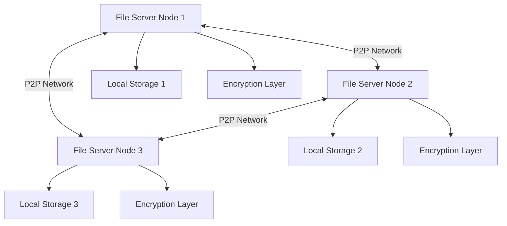

# Distributed File System - Project Overview

## What is This Project?

This is a **distributed file system** written in Go that allows multiple computers (nodes) to work together to store and retrieve files. Think of it like a simplified version of systems like BitTorrent or IPFS, where files are spread across multiple computers rather than being stored on just one machine.

## Why Does This Exist?

Traditional file storage keeps all your files on one computer or server. If that machine fails, you lose access to all your files. A distributed file system solves this by:

1. **Redundancy**: Files are stored on multiple machines, so if one fails, you can still get your files from others
2. **Scalability**: You can add more machines to increase storage capacity
3. **Decentralization**: No single point of failure - the system works as long as at least one node is running

## High-Level Architecture



## Core Components

The system is built from several layers, each handling a specific responsibility:

### 1. **P2P (Peer-to-Peer) Network Layer** (`p2p/` directory)
- Handles communication between different nodes in the network
- Manages TCP connections between computers
- Defines how nodes discover and talk to each other
- **Files**: `transport.go`, `tcp_transport.go`, `message.go`, `encoding.go`, `handshake.go`

### 2. **Storage Layer** (`store.go`)
- Manages how files are actually saved to disk
- Organizes files in a special directory structure
- Handles reading and writing files
- Uses content-addressable storage (explained in detail later)

### 3. **Encryption Layer** (`crypto.go`)
- Ensures files are encrypted before being sent over the network
- Encrypts files when storing them
- Decrypts files when retrieving them
- Uses AES encryption for security

### 4. **File Server** (`server.go`)
- The main orchestrator that ties everything together
- Manages file storage and retrieval across the network
- Handles incoming requests from other nodes
- Broadcasts file information to peers

### 5. **Main Application** (`main.go`)
- Entry point of the application
- Sets up and starts multiple file server nodes
- Demonstrates how the system works in action

## How Does It Work? (Simple Explanation)

Let's walk through what happens when you store and retrieve a file:

### Storing a File

1. **You give a file to one node** (e.g., "picture.png")
2. **The node encrypts the file** using AES encryption
3. **The node saves it locally** in a special folder structure
4. **The node tells all its peers** about the new file
5. **Peer nodes receive and store** copies of the encrypted file

### Retrieving a File

1. **You ask a node for a file** (e.g., "picture.png")
2. **If the node has it locally**, it reads and returns it
3. **If the node doesn't have it**, it asks its peers
4. **A peer with the file sends it** over the network
5. **The requesting node decrypts and returns** the file to you

## Key Features

### 🔐 Encryption
All files are encrypted using AES-256 before being stored or transmitted. This ensures:
- Files are secure even if someone intercepts network traffic
- Files on disk are protected from unauthorized access

### 📦 Content-Addressable Storage (CAS)
Files are stored using their content hash, not their original filename:
- Same files with different names are only stored once
- Files are automatically deduplicated
- File integrity can be verified using the hash

### 🌐 Peer-to-Peer Architecture
No central server - all nodes are equal:
- Any node can request or serve files
- System continues working even if some nodes go offline
- Easy to add new nodes to the network

### 🔄 Automatic Replication
When a file is stored on one node, it's automatically replicated to all connected peers:
- Ensures high availability
- Protects against data loss
- Improves read performance

## System Requirements

- **Language**: Go 1.18 or higher
- **Operating System**: Linux, macOS, or Windows
- **Network**: TCP/IP connectivity between nodes
- **Dependencies**: Listed in `go.mod`

## Project Structure

```
distributedfilesystemgo/
├── p2p/                    # Peer-to-peer networking layer
│   ├── transport.go        # Transport interface definitions
│   ├── tcp_transport.go    # TCP implementation
│   ├── message.go          # Message types
│   ├── encoding.go         # Data encoding/decoding
│   └── handshake.go        # Peer handshake logic
├── server.go               # Main file server implementation
├── store.go                # File storage management
├── crypto.go               # Encryption/decryption utilities
├── main.go                 # Application entry point
├── Makefile                # Build commands
└── docs/                   # This documentation
```

## Quick Start

```bash
# Build the project
make build

# Run the project (starts 3 nodes and demonstrates file operations)
make run

# Run tests
make test
```

## What's Next?

To understand this system in depth, we recommend reading the documentation in this order:

1. **[P2P Network Layer](./01-p2p-network.md)** - Learn how nodes communicate
2. **[Storage System](./02-storage-system.md)** - Understand how files are organized
3. **[Encryption](./03-encryption.md)** - See how files are secured
4. **[File Server](./04-file-server.md)** - Discover how everything works together
5. **[Message Protocol](./05-message-protocol.md)** - Deep dive into network communication
6. **[Example Workflows](./06-workflows.md)** - Step-by-step walkthroughs of operations

## Terminology

Here are some terms you'll see throughout the documentation:

- **Node**: A single instance of the file server running on a computer
- **Peer**: Another node that this node is connected to
- **Transport**: The mechanism used to send data between nodes (TCP in this case)
- **RPC**: Remote Procedure Call - a message sent from one node to another
- **Stream**: A continuous flow of data (used for large file transfers)
- **Hash**: A unique fingerprint of a file's contents
- **Encryption Key**: A secret value used to encrypt/decrypt data
- **Bootstrap Node**: An initial node that new nodes connect to when joining the network

## Design Philosophy

This project follows several key principles:

1. **Simplicity**: The code is designed to be educational and easy to understand
2. **Modularity**: Each component has a clear, single responsibility
3. **Interface-Driven**: Uses Go interfaces to allow flexibility and testing
4. **Concurrent**: Leverages Go's goroutines for handling multiple operations simultaneously
5. **Secure by Default**: All network communication and storage is encrypted

## Limitations & Future Improvements

Current limitations:
- No persistence of peer connections (nodes forget each other on restart)
- Simple broadcast mechanism (not optimized for large networks)
- No built-in node discovery (must manually specify bootstrap nodes)
- Files are always replicated to all peers (no selective replication)
- No garbage collection for deleted files

Potential improvements:
- Add a DHT (Distributed Hash Table) for better file location
- Implement peer discovery protocols
- Add selective replication based on storage capacity
- Implement file versioning
- Add authentication and authorization
- Create a REST API or CLI for easier interaction
