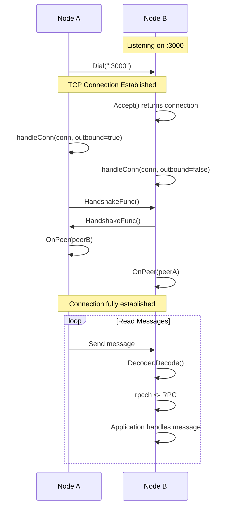
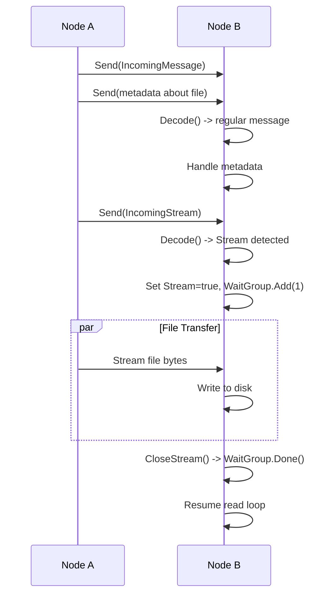

# P2P (Peer-to-Peer) Network Layer

## What is P2P?

**Peer-to-Peer (P2P)** means that all computers in the network are equals - there's no "boss" computer giving orders. Each node (computer) can:
- Send messages to other nodes
- Receive messages from other nodes
- Request files from other nodes
- Serve files to other nodes

Think of it like a group chat where everyone can talk to everyone else, rather than everyone talking through one person in the middle.

## Directory Structure

All P2P networking code is in the `p2p/` directory:

```
p2p/
├── transport.go         # Core interfaces (what can a transport/peer do?)
├── tcp_transport.go     # TCP implementation (how to do it with TCP)
├── message.go           # Message type definitions
├── encoding.go          # How to encode/decode messages
├── handshake.go         # How nodes greet each other
└── tcp_transport_test.go # Tests
```

---

## Core Concepts

### 1. Transport Interface (`transport.go`)

**What is a Transport?**

A "transport" is the method used to send data between nodes. This could be:
- TCP (what we use)
- UDP
- WebSockets
- Any other communication protocol

**Why use an interface?**

By defining an interface, we can swap out the transport method without changing the rest of the code. For example, we could replace TCP with UDP without touching the file server code.

#### Transport Interface Definition

```go
type Transport interface {
    Addr() string              // What's my address?
    Dial(string) error         // Connect to another node
    ListenAndAccept() error    // Start listening for connections
    Consume() <-chan RPC       # Where do messages come from?
    Close() error              // Clean up when done
}
```

Let's break down each method:

| Method | Purpose | Example |
|--------|---------|---------|
| `Addr()` | Returns this node's listening address | `:3000` means port 3000 on this computer |
| `Dial(addr)` | Initiate a connection to another node | Connect to `:5000` |
| `ListenAndAccept()` | Start accepting incoming connections | Start listening on `:3000` |
| `Consume()` | Get a channel to receive messages | Returns a channel with incoming messages |
| `Close()` | Shut down the transport cleanly | Close all connections |

### 2. Peer Interface (`transport.go`)

**What is a Peer?**

A peer represents a **specific connection** to another node. If you're connected to 3 other computers, you have 3 peers.

#### Peer Interface Definition

```go
type Peer interface {
    net.Conn              // Embeds Go's standard connection type
    Send([]byte) error    // Send raw bytes to this peer
    CloseStream()         // Close current file stream
}
```

**Key points:**
- A `Peer` embeds `net.Conn`, meaning it can do everything a normal network connection can do (Read, Write, Close, etc.)
- `Send()` is a convenience method for writing bytes
- `CloseStream()` signals that we're done transferring a file

---

## TCP Transport Implementation

The `TCPTransport` is the concrete implementation that uses TCP (Transmission Control Protocol) for network communication.

### TCPPeer (`tcp_transport.go`)

This represents one TCP connection to another node.

```go
type TCPPeer struct {
    net.Conn          // The actual TCP connection
    outbound bool     // true = we initiated, false = they initiated
    wg *sync.WaitGroup // Used to wait for file transfers to complete
}
```

**Why track `outbound`?**

Knowing who initiated the connection can be useful for:
- Debugging (logging who connected to whom)
- Security (treating incoming vs outgoing connections differently)
- Connection management

**Why use `sync.WaitGroup`?**

When transferring large files, we need to:
1. Start sending the file (in the background)
2. Continue processing other messages
3. Wait for the file transfer to complete before continuing

The `WaitGroup` helps us coordinate this:

```go
// When starting a file transfer:
peer.wg.Add(1)        // Signal that we're busy
// ... transfer file ...
peer.wg.Done()        // Signal we're done (called via CloseStream)

// Somewhere else:
peer.wg.Wait()        // Wait until the transfer is complete
```

#### TCPPeer Methods

```go
func (p *TCPPeer) Send(b []byte) error {
    _, err := p.Conn.Write(b)
    return err
}

func (p *TCPPeer) CloseStream() {
    p.wg.Done()
}
```

These are simple wrappers that make the code more readable and semantic.

### TCPTransport (`tcp_transport.go`)

This is the main transport that manages all TCP connections.

```go
type TCPTransport struct {
    TCPTransportOpts
    listener net.Listener  // Listens for incoming connections
    rpcch    chan RPC      // Channel for incoming messages
}
```

#### Configuration Options

```go
type TCPTransportOpts struct {
    ListenAddr    string         // Address to listen on (e.g., ":3000")
    HandshakeFunc HandshakeFunc  // Function to validate new peers
    Decoder       Decoder        // How to decode incoming data
    OnPeer        func(Peer) error // Called when a new peer connects
}
```

Let's examine each option:

##### 1. ListenAddr

The address format is `host:port`:
- `:3000` means "listen on port 3000 on all network interfaces"
- `localhost:3000` means "only accept connections from this computer"
- `192.168.1.5:3000` means "listen on a specific IP address"

##### 2. HandshakeFunc

When two nodes connect, they might want to verify each other:
- Exchange version information
- Authenticate
- Exchange encryption keys

The `HandshakeFunc` is called right after a connection is established:

```go
type HandshakeFunc func(Peer) error
```

In this project, we use `NOPHandshakeFunc` (No Operation):
```go
func NOPHandshakeFunc(Peer) error { return nil }
```

This means "don't do any handshake, just accept everyone." In a production system, you'd implement proper authentication here.

##### 3. Decoder

The decoder determines how to interpret incoming bytes:

```go
type Decoder interface {
    Decode(io.Reader, *RPC) error
}
```

We have two implementations:
- `DefaultDecoder`: Reads raw bytes with a message type prefix
- `GOBDecoder`: Uses Go's GOB encoding (not used in this project)

##### 4. OnPeer

This callback is invoked when a new peer successfully connects:

```go
func (s *FileServer) OnPeer(p p2p.Peer) error {
    s.peerLock.Lock()
    defer s.peerLock.Unlock()
    
    s.peers[p.RemoteAddr().String()] = p
    log.Printf("connected with remote %s", p.RemoteAddr())
    
    return nil
}
```

This example adds the peer to a map and logs the connection.

---

## Key TCP Transport Methods

### 1. Creating a Transport

```go
func NewTCPTransport(opts TCPTransportOpts) *TCPTransport {
    return &TCPTransport{
        TCPTransportOpts: opts,
        rpcch:            make(chan RPC, 1024),  // Buffer up to 1024 messages
    }
}
```

**Why buffer the channel?**

Buffering allows:
- Senders to continue without waiting for receivers
- Smoothing out bursts of messages
- Better performance under high load

The size `1024` is arbitrary but reasonable for most use cases.

### 2. Starting the Transport

```go
func (t *TCPTransport) ListenAndAccept() error {
    var err error
    
    // Create a TCP listener
    t.listener, err = net.Listen("tcp", t.ListenAddr)
    if err != nil {
        return err
    }
    
    // Start accepting connections in the background
    go t.startAcceptLoop()
    
    log.Printf("TCP transport listening on port: %s\n", t.ListenAddr)
    
    return nil
}
```

**What's happening here?**

1. `net.Listen("tcp", t.ListenAddr)` creates a TCP listener
2. The listener will accept incoming connections on the specified address
3. `go t.startAcceptLoop()` starts a goroutine (background thread) to handle connections
4. The function returns immediately (non-blocking)

### 3. Accepting Connections Loop

```go
func (t *TCPTransport) startAcceptLoop() {
    for {
        // Wait for a connection
        conn, err := t.listener.Accept()
        
        // If we've closed the listener, exit gracefully
        if errors.Is(err, net.ErrClosed) {
            return
        }
        
        if err != nil {
            fmt.Printf("TCP accept error: %s\n", err)
        }
        
        // Handle this connection in the background
        go t.handleConn(conn, false)  // false = inbound connection
    }
}
```

**Flow:**
1. Wait for someone to connect (`Accept()` blocks until a connection arrives)
2. When a connection arrives, handle it in a new goroutine
3. Immediately go back to waiting for the next connection

This allows handling multiple connections simultaneously!

### 4. Connecting to Another Node

```go
func (t *TCPTransport) Dial(addr string) error {
    // Establish a TCP connection
    conn, err := net.Dial("tcp", addr)
    if err != nil {
        return err
    }
    
    // Handle the connection (outbound = true)
    go t.handleConn(conn, true)
    
    return nil
}
```

**Outbound vs Inbound:**
- `Dial()` creates an **outbound** connection (we initiated it)
- `Accept()` creates an **inbound** connection (they initiated it)

### 5. Handling a Connection

```go
func (t *TCPTransport) handleConn(conn net.Conn, outbound bool) {
    var err error
    
    defer func() {
        fmt.Printf("dropping peer connection: %s", err)
        conn.Close()
    }()
    
    peer := NewTCPPeer(conn, outbound)
    
    // Perform handshake
    if err = t.HandshakeFunc(peer); err != nil {
        return
    }
    
    // Notify the application about the new peer
    if t.OnPeer != nil {
        if err = t.OnPeer(peer); err != nil {
            return
        }
    }
    
    // Read loop - continuously read messages
    for {
        rpc := RPC{}
        err = t.Decoder.Decode(conn, &rpc)
        if err != nil {
            return
        }
        
        rpc.From = conn.RemoteAddr().String()
        
        // If it's a file stream, wait for it to complete
        if rpc.Stream {
            peer.wg.Add(1)
            fmt.Printf("[%s] incoming stream, waiting...\n", conn.RemoteAddr())
            peer.wg.Wait()
            fmt.Printf("[%s] stream closed, resuming read loop\n", conn.RemoteAddr())
            continue
        }
        
        // Send the message to the application
        t.rpcch <- rpc
    }
}
```

**This is the heart of the P2P communication!** Let's break it down:

#### Step 1: Setup and Cleanup

```go
defer func() {
    fmt.Printf("dropping peer connection: %s", err)
    conn.Close()
}()
```

The `defer` ensures that when this function exits (for any reason), we:
1. Log why we're disconnecting
2. Close the connection properly

#### Step 2: Create the Peer

```go
peer := NewTCPPeer(conn, outbound)
```

Wrap the raw connection in our `TCPPeer` type.

#### Step 3: Handshake

```go
if err = t.HandshakeFunc(peer); err != nil {
    return  // Exit if handshake fails
}
```

This is where nodes would verify each other's identity, exchange keys, etc.

#### Step 4: Notify Application

```go
if t.OnPeer != nil {
    if err = t.OnPeer(peer); err != nil {
        return
    }
}
```

Let the application know a new peer has connected. The file server uses this to add the peer to its peer map.

#### Step 5: Read Loop

```go
for {
    rpc := RPC{}
    err = t.Decoder.Decode(conn, &rpc)
    if err != nil {
        return  // Connection closed or error occurred
    }
    
    rpc.From = conn.RemoteAddr().String()
    // ... handle the message
}
```

This infinite loop:
1. Creates an empty RPC struct
2. Reads data from the connection and fills the RPC
3. Adds the sender's address to the RPC
4. Processes the message

If `Decode()` returns an error, it usually means the connection was closed, so we exit the loop.

#### Step 6: Handle Streaming

```go
if rpc.Stream {
    peer.wg.Add(1)
    fmt.Printf("[%s] incoming stream, waiting...\n", conn.RemoteAddr())
    peer.wg.Wait()
    fmt.Printf("[%s] stream closed, resuming read loop\n", conn.RemoteAddr())
    continue
}
```

**Why do we need special handling for streams?**

When transferring a large file:
1. We can't decode it as a regular message (it's too big!)
2. We need to stream it directly to disk
3. We need to pause the read loop until the file transfer completes

The flow is:
1. Decoder detects this is a stream (not a regular message)
2. `peer.wg.Add(1)` - mark that a stream is in progress
3. `peer.wg.Wait()` - pause the read loop
4. The file server handles the stream in another goroutine
5. When done, it calls `peer.CloseStream()` which calls `wg.Done()`
6. `Wait()` unblocks and we resume reading messages

---

## Messages and Encoding

### Message Types (`message.go`)

```go
const (
    IncomingMessage = 0x1  // This is a regular message
    IncomingStream  = 0x2  // This is a file stream
)

type RPC struct {
    From    string   // Who sent this message
    Payload []byte   // The actual message data
    Stream  bool     // Is this a stream?
}
```

**Why use constants?**

Instead of writing `1` and `2` everywhere, we use named constants:
- More readable: `IncomingMessage` vs `0x1`
- Easier to change: modify the constant, not every occurrence
- Less error-prone: typo in `IncomingMessage` causes a compile error, typo in `1` doesn't

**The `0x` prefix** means hexadecimal notation:
- `0x1` = 1 in decimal
- `0x2` = 2 in decimal

It's convention to use hex for byte values.

### Default Decoder (`encoding.go`)

```go
func (dec DefaultDecoder) Decode(r io.Reader, msg *RPC) error {
    // Read the first byte (message type)
    peekBuf := make([]byte, 1)
    if _, err := r.Read(peekBuf); err != nil {
        return nil
    }
    
    // Check if it's a stream
    stream := peekBuf[0] == IncomingStream
    if stream {
        msg.Stream = true
        return nil  // Don't read any more data
    }
    
    // It's a regular message, read the payload
    buf := make([]byte, 1028)
    n, err := r.Read(buf)
    if err != nil {
        return err
    }
    
    msg.Payload = buf[:n]
    
    return nil
}
```

**How it works:**

```
   Byte Stream from Network
   ┌─────┬──────────────────┐
   │ Type│   Payload        │
   └─────┴──────────────────┘
     1B      Variable size
     
Type byte:
  0x1 = Message (read payload into buf)
  0x2 = Stream (stop reading, set Stream=true)
```

**Why `buf[:n]`?**

We allocate a buffer of 1028 bytes, but the actual message might be shorter. `n` is the number of bytes actually read, so `buf[:n]` gives us only the filled portion.

**Example:**
```go
buf := make([]byte, 1028)  // buf = [0,0,0,...,0] (1028 zeros)
n, _ := r.Read(buf)        // Read 100 bytes
// buf = [data data data ... data, 0, 0, ..., 0]
//        ← 100 bytes →       ← 928 zeros →
payload := buf[:n]         // payload = just the 100 bytes of data
```

---

## Handshake (`handshake.go`)

```go
type HandshakeFunc func(Peer) error

func NOPHandshakeFunc(Peer) error { return nil }
```

**NOP** = No Operation

This is a placeholder. In a real system, you might have:

```go
func SecureHandshake(p Peer) error {
    // 1. Send our node ID
    p.Send([]byte(myNodeID))
    
    // 2. Read their node ID
    theirID := make([]byte, 64)
    p.Read(theirID)
    
    // 3. Verify they're allowed to connect
    if !isAllowed(theirID) {
        return errors.New("unauthorized peer")
    }
    
    // 4. Exchange encryption keys
    // ... more complex logic ...
    
    return nil
}
```

---

## Putting It All Together

Here's how the P2P layer works in practice:

### Scenario: Node A connects to Node B



### Scenario: Sending a file



---

## Common Questions

### Q: Why use channels for messages?

**A:** Channels are Go's way of safely sending data between goroutines (threads). They provide:
- Thread-safe communication
- Backpressure (if the channel is full, senders wait)
- Clean code (no mutexes needed)

### Q: What happens if a peer disconnects?

**A:** When `Decode()` or `Read()` encounters a closed connection, it returns an error. This causes `handleConn()` to return, triggering the `defer` which closes the connection cleanly.

### Q: Can we have multiple transports?

**A:** Yes! You could create a `UDPTransport`, `WebSocketTransport`, etc. As long as they implement the `Transport` interface, the file server can use them without modification.

### Q: Why separate Transport and Peer?

**A:** 
- `Transport` = The listening mechanism (one per node)
- `Peer` = A specific connection (many per node)

One transport manages many peers.

### Q: What's the difference between Send() and Write()?

**A:** They're almost identical. `Send()` is a semantic wrapper around `Write()` that makes the intent clearer:
- `peer.Send(data)` - "send this message to the peer"
- `peer.Write(data)` - "write these bytes to the connection"

Same result, but `Send` is more expressive.

---

## Summary

The P2P network layer provides:

1. **Abstraction**: Transport and Peer interfaces allow flexibility
2. **TCP Implementation**: Reliable, connection-oriented communication
3. **Message Handling**: Distinguish between messages and file streams
4. **Concurrency**: Handle multiple peers simultaneously withgoroutines
5. **Simplicity**: Clean, understandable code structure

This layer is completely independent of file storage and can be reused for any P2P application!
