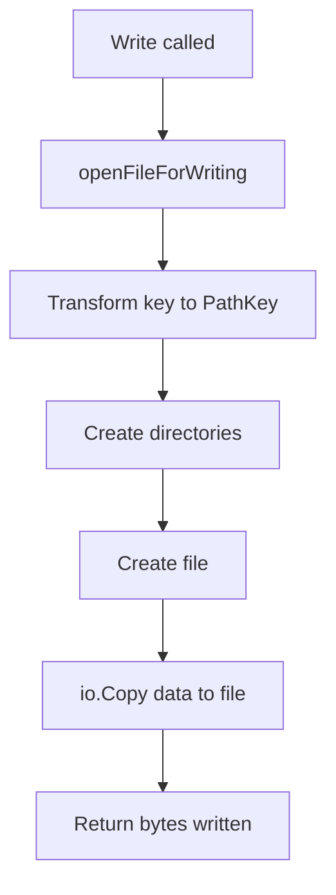

# Storage System - File Organization and Management

## What is the Storage System?

The storage system is responsible for **organizing and managing how files are stored on disk**. Think of it as the file system layer that decides:
- Where to save files
- How to name them
- How to organize them in directories
- How to retrieve them later

## Core File: `store.go`

All storage logic is contained in [`store.go`](file:///home/siddhantcvdi/codespace/distributedfilesystemgo/store.go).

---

## Key Concepts

### Content-Addressable Storage (CAS)

This is the most important concept in the storage system!

**Traditional file storage:**
```
/documents/report.pdf
/pictures/vacation.jpg
```
Files are stored by their **name and location**.

**Content-Addressable Storage:**
```
/store/a3f2b/8c9d1/4e5f6/... (hash of contents)
```
Files are stored by their **content's fingerprint (hash)**.

**Why is this better?**

1. **Deduplication**: Same content = same hash = stored only once
   ```
   photo_original.jpg → hash: abc123
   photo_copy.jpg     → hash: abc123  (same content, same hash!)
   ```
   Even though they have different names, they're stored as one file.

2. **Integrity**: If the file is corrupted, the hash won't match
   ```
   Expected hash: abc123
   Actual hash:   abc456  ← File is corrupted!
   ```

3. **Distribution**: Other nodes can ask for a file by its hash
   ```
   "Hey, do you have file with hash abc123?"
   ```

---

## Core Data Structures

### PathKey

```go
type PathKey struct {
    PathName string    // The directory path (e.g., "a3f2b/8c9d1/4e5f6")
    Filename string    // The actual filename (the full hash)
}
```

**Example:**
```go
pathKey := PathKey{
    PathName: "a3f2b/8c9d1/4e5f6/7a8b9",
    Filename: "a3f2b8c9d14e5f67a8b9c0d1e2f3a4b5c6d7e8f9",
}
```

**Methods:**

#### 1. FullPath()
```go
func (p PathKey) FullPath() string {
    return fmt.Sprintf("%s/%s", p.PathName, p.Filename)
}
```

Returns the complete path to the file:
```
"a3f2b/8c9d1/4e5f6/7a8b9/a3f2b8c9d14e5f67a8b9c0d1e2f3a4b5c6d7e8f9"
```

#### 2. FirstPathName()
```go
func (p PathKey) FirstPathName() string {
    paths := strings.Split(p.PathName, "/")
    if len(paths) == 0 {
        return ""
    }
    return paths[0]
}
```

Returns the first directory in the path:
```
Input:  "a3f2b/8c9d1/4e5f6"
Output: "a3f2b"
```

**Why do we need this?**

When deleting a file, we delete the entire first directory:
```go
os.RemoveAll(firstPathName)  // Deletes "a3f2b" and everything under it
```

---

### PathTransformFunc

```go
type PathTransformFunc func(string) PathKey
```

This is a **function type** that transforms a user-provided key into a `PathKey`.

**Why use a function type?**

Different storage strategies can be swapped easily:
- Content-addressable storage (hash-based)
- Traditional storage (name-based)
- Custom schemes

---

### CASPathTransformFunc

This is the **content-addressable storage transformation function**:

```go
func CASPathTransformFunc(key string) PathKey {
    hash := sha1.Sum([]byte(key))
    hashStr := hex.EncodeToString(hash[:])
    
    blocksize := 5
    sliceLen := len(hashStr) / blocksize
    paths := make([]string, sliceLen)
    
    for i := 0; i < sliceLen; i++ {
        from, to := i*blocksize, (i*blocksize)+blocksize
        paths[i] = hashStr[from:to]
    }
    
    return PathKey{
        PathName: strings.Join(paths, "/"),
        Filename: hashStr,
    }
}
```

Let's break this down step by step:

#### Step 1: Hash the key
```go
hash := sha1.Sum([]byte(key))
```

SHA-1 creates a 160-bit (20-byte) hash:
```
Input:  "myfile.txt"
Output: [174 129 47 201 ...] (20 bytes)
```

#### Step 2: Convert to hex string
```go
hashStr := hex.EncodeToString(hash[:])
```

Convert the bytes to a human-readable hex string:
```
Input:  [174 129 47 201 ...]
Output: "ae812fc9..." (40 characters)
```

Why 40 characters? Each byte becomes 2 hex digits: 20 bytes × 2 = 40 characters.

#### Step 3: Split into blocks
```go
blocksize := 5
sliceLen := len(hashStr) / blocksize  // 40 / 5 = 8 blocks
paths := make([]string, sliceLen)

for i := 0; i < sliceLen; i++ {
    from, to := i*blocksize, (i*blocksize)+blocksize
    paths[i] = hashStr[from:to]
}
```

Split the 40-character hash into 8 blocks of 5 characters each:
```
hash: "ae812fc9a1b2c3d4e5f6a7b8c9d0e1f2a3b4c5d6"

Block 0: "ae812"  (characters 0-5)
Block 1: "fc9a1"  (characters 5-10)
Block 2: "b2c3d"  (characters 10-15)
Block 3: "4e5f6"  (characters 15-20)
Block 4: "a7b8c"  (characters 20-25)
Block 5: "9d0e1"  (characters 25-30)
Block 6: "f2a3b"  (characters 30-35)
Block 7: "4c5d6"  (characters 35-40)
```

#### Step 4: Create the path
```go
return PathKey{
    PathName: strings.Join(paths, "/"),
    Filename: hashStr,
}
```

Join the blocks with slashes:
```
PathName: "ae812/fc9a1/b2c3d/4e5f6/a7b8c/9d0e1/f2a3b/4c5d6"
Filename: "ae812fc9a1b2c3d4e5f6a7b8c9d0e1f2a3b4c5d6"
```

**Why split the hash into directories?**

File systems slow down with too many files in one directory. By splitting the hash, we distribute files across many directories:

```
❌ Bad (flat):
/store/
  ├── ae812fc9a1b2c3d4e5f6a7b8c9d0e1f2a3b4c5d6
  ├── bf923ad0b1c2d3e4f5a6b7c8d9e0f1a2b3c4d5e6
  ├── ... (millions of files in one directory!)

✅ Good (nested):
/store/
  ├── ae812/
  │   └── fc9a1/
  │       └── b2c3d/
  │           └── ... 
  ├── bf923/
      └── ad0b1/
          └── ...
```

Each directory has fewer files, making lookups faster!

---

### Store Configuration

```go
type StoreOpts struct {
    Root              string              // Root directory for all files
    PathTransformFunc PathTransformFunc   // How to transform keys to paths
}
```

**Defaults:**

```go
const defaultRootFolderName = "ggnetwork"

var DefaultPathTransformFunc = func(key string) PathKey {
    return PathKey{
        PathName: key,
        Filename: key,
    }
}
```

If you don't specify options, it will:
- Store files in `./ggnetwork/`
- Use the key as-is for the path (no hashing)

---

### Store Structure

```go
type Store struct {
    StoreOpts
}

func NewStore(opts StoreOpts) *Store {
    if opts.PathTransformFunc == nil {
        opts.PathTransformFunc = DefaultPathTransformFunc
    }
    if len(opts.Root) == 0 {
        opts.Root = defaultRootFolderName
    }
    
    return &Store{
        StoreOpts: opts,
    }
}
```

The `Store` embeds `StoreOpts`, meaning it has direct access to `Root` and `PathTransformFunc`:

```go
s := NewStore(opts)
fmt.Println(s.Root)                    // Direct access
path := s.PathTransformFunc("mykey")   // Direct access
```

---

## Store Operations

### Directory Structure

Files are organized with this structure:
```
{Root}/
  └── {NodeID}/
      └── {PathName}/
          └── {Filename}
```

**Example:**
```
:3000_network/
  └── abc123def456.../  (NodeID)
      └── ae812/fc9a1/b2c3d/.../
          └── ae812fc9a1b2c3d4e5f6...  (Full hash)
```

Each node has its own directory identified by the node ID!

### 1. Writing a File

```go
func (s *Store) Write(id string, key string, r io.Reader) (int64, error) {
    return s.writeStream(id, key, r)
}

func (s *Store) writeStream(id string, key string, r io.Reader) (int64, error) {
    f, err := s.openFileForWriting(id, key)
    if err != nil {
        return 0, err
    }
    return io.Copy(f, r)
}
```

**Parameters:**
- `id`: Node ID (who owns this file)
- `key`: User-provided key (e.g., "picture.png")
- `r`: Reader containing the file data

**Flow:**



#### Opening a File for Writing

```go
func (s *Store) openFileForWriting(id string, key string) (*os.File, error) {
    pathKey := s.PathTransformFunc(key)
    pathNameWithRoot := fmt.Sprintf("%s/%s/%s", s.Root, id, pathKey.PathName)
    
    // Create all necessary directories
    if err := os.MkdirAll(pathNameWithRoot, os.ModePerm); err != nil {
        return nil, err
    }
    
    fullPathWithRoot := fmt.Sprintf("%s/%s/%s", s.Root, id, pathKey.FullPath())
    
    return os.Create(fullPathWithRoot)
}
```

**Step-by-step example:**

Given:
- `s.Root = ":3000_network"`
- `id = "node123"`
- `key = "picture.png"`

The function:

1. **Transforms the key:**
   ```go
   pathKey = CASPathTransformFunc("picture.png")
   // PathName = "ae812/fc9a1/..."
   // Filename = "ae812fc9a1b2c3d..."
   ```

2. **Creates directory path:**
   ```go
   pathNameWithRoot = ":3000_network/node123/ae812/fc9a1/b2c3d/..."
   ```

3. **Creates all directories:**
   ```go
   os.MkdirAll(pathNameWithRoot, os.ModePerm)
   // Creates: :3000_network/
   //          :3000_network/node123/
   //          :3000_network/node123/ae812/
   //          :3000_network/node123/ae812/fc9a1/
   //          ... and so on
   ```

4. **Creates the file:**
   ```go
   fullPathWithRoot = ":3000_network/node123/ae812/fc9a1/.../ae812fc9a1b2c3d..."
   return os.Create(fullPathWithRoot)
   ```

**`os.ModePerm`** = 0777 = Full read/write/execute permissions for everyone.

**`io.Copy(f, r)`** reads from `r` and writes to `f` until EOF, returning the number of bytes copied.

---

### 2. Writing with Decryption

```go
func (s *Store) WriteDecrypt(encKey []byte, id string, key string, r io.Reader) (int64, error) {
    f, err := s.openFileForWriting(id, key)
    if err != nil {
        return 0, err
    }
    n, err := copyDecrypt(encKey, r, f)
    return int64(n), err
}
```

This is similar to `Write`, but:
- Reads encrypted data from `r`
- Decrypts it on the fly
- Writes decrypted data to `f`

**When is this used?**

When receiving an encrypted file from the network, we decrypt it before storing it locally.

---

### 3. Reading a File

```go
func (s *Store) Read(id string, key string) (int64, io.Reader, error) {
    return s.readStream(id, key)
}

func (s *Store) readStream(id string, key string) (int64, io.ReadCloser, error) {
    pathKey := s.PathTransformFunc(key)
    fullPathWithRoot := fmt.Sprintf("%s/%s/%s", s.Root, id, pathKey.FullPath())
    
    file, err := os.Open(fullPathWithRoot)
    if err != nil {
        return 0, nil, err
    }
    
    fi, err := file.Stat()
    if err != nil {
        return 0, nil, err
    }
    
    return fi.Size(), file, nil
}
```

**Returns:**
- File size (in bytes)
- Reader to read the file contents
- Error (if any)

**Step-by-step:**

1. **Transform key to path:**
   ```go
   pathKey = s.PathTransformFunc(key)
   ```

2. **Build full path:**
   ```go
   fullPathWithRoot = ":3000_network/node123/ae812/fc9a1/.../ae812fc9a1..."
   ```

3. **Open the file:**
   ```go
   file, err := os.Open(fullPathWithRoot)
   ```

4. **Get file metadata:**
   ```go
   fi, err := file.Stat()  // File info (size, modification time, etc.)
   ```

5. **Return size and reader:**
   ```go
   return fi.Size(), file, nil
   ```

**Important:** The caller is responsible for closing the file!

```go
size, reader, _ := store.Read(id, key)
defer reader.Close()  // Don't forget!
```

---

### 4. Checking if a File Exists

```go
func (s *Store) Has(id string, key string) bool {
    pathKey := s.PathTransformFunc(key)
    fullPathWithRoot := fmt.Sprintf("%s/%s/%s", s.Root, id, pathKey.FullPath())
    
    _, err := os.Stat(fullPathWithRoot)
    return !errors.Is(err, os.ErrNotExist)
}
```

**How it works:**

`os.Stat()` returns information about a file. If the file doesn't exist, it returns `os.ErrNotExist`.

```go
_, err := os.Stat("nonexistent.txt")
errors.Is(err, os.ErrNotExist)  // true

_, err := os.Stat("exists.txt")
errors.Is(err, os.ErrNotExist)  // false
```

So:
- `errors.Is(err, os.ErrNotExist)` = true → file doesn't exist → return false
- `errors.Is(err, os.ErrNotExist)` = false → file exists (or other error) → return true

**Note:** This might return true for other errors (like permission denied), not just when the file exists. A more robust version would be:

```go
func (s *Store) Has(id string, key string) bool {
    pathKey := s.PathTransformFunc(key)
    fullPathWithRoot := fmt.Sprintf("%s/%s/%s", s.Root, id, pathKey.FullPath())
    
    _, err := os.Stat(fullPathWithRoot)
    return err == nil  // Only return true if no error
}
```

---

### 5. Deleting a File

```go
func (s *Store) Delete(id string, key string) error {
    pathKey := s.PathTransformFunc(key)
    
    defer func() {
        log.Printf("deleted [%s] from disk", pathKey.Filename)
    }()
    
    firstPathNameWithRoot := fmt.Sprintf("%s/%s/%s", s.Root, id, pathKey.FirstPathName())
    
    return os.RemoveAll(firstPathNameWithRoot)
}
```

**Important:** This deletes the **entire first directory**, not just the file!

**Example:**

File stored at:
```
:3000_network/node123/ae812/fc9a1/b2c3d/.../ae812fc9a1...
```

Deleting:
```go
firstPathNameWithRoot = ":3000_network/node123/ae812"
os.RemoveAll(firstPathNameWithRoot)
```

This removes:
```
:3000_network/
  └── node123/
      └── ae812/     ← Entire directory removed!
          └── fc9a1/
              └── ...
```

**Why delete the whole first directory?**

With CAS, each file gets its own unique directory structure based on its hash. There's no reason to keep the directory tree after deleting the file.

**Caveat:** If two files happen to have hashes starting with the same 5 characters, they'll share the first directory:

```
:3000_network/node123/ae812/
  ├── fc9a1/.../file1
  └── ab123/.../file2
```

Deleting `file1` would also delete `file2`! This is a simplification in the design. A proper implementation would:
1. Delete only the specific file
2. Check if the directory is empty
3. Remove the directory only if empty

---

### 6. Clearing All Files

```go
func (s *Store) Clear() error {
    return os.RemoveAll(s.Root)
}
```

**Warning:** This deletes **everything** in the root directory!

```
:3000_network/
  └── ... everything inside is deleted!
```

Use with caution! This is mainly useful for testing:

```go
func TestStorageOperations(t *testing.T) {
    store := NewStore(StoreOpts{Root: "test_storage"})
    defer store.Clear()  // Clean up after the test
    
    // ... test operations ...
}
```

---

## File Organization Example

Let's walk through a complete example:

### Storing "picture.png"

1. **Node receives file:**
   ```go
   data := bytes.NewReader([]byte("my picture data"))
   store.Write("node123", "picture.png", data)
   ```

2. **Hash the key:**
   ```go
   hash("picture.png") = "ae812fc9a1b2c3d4e5f6a7b8c9d0e1f2a3b4c5d6"
   ```

3. **Split hash into blocks:**
   ```
   "ae812/fc9a1/b2c3d/4e5f6/a7b8c/9d0e1/f2a3b/4c5d6"
   ```

4. **Create directory structure:**
   ```
   :3000_network/
     └── node123/
         └── ae812/
             └── fc9a1/
                 └── b2c3d/
                     └── 4e5f6/
                         └── a7b8c/
                             └── 9d0e1/
                                 └── f2a3b/
                                     └── 4c5d6/
   ```

5. **Write file:**
   ```
   :3000_network/node123/ae812/.../4c5d6/ae812fc9a1b2c3d4e5f6a7b8c9d0e1f2a3b4c5d6
   └── Contents: "my picture data"
   ```

6. **Later, retrieve it:**
   ```go
   size, reader, _ := store.Read("node123", "picture.png")
   // Hash "picture.png" again, find the same file!
   ```

---

## Comparison: Different Storage Strategies

### Using DefaultPathTransformFunc

```go
store := NewStore(StoreOpts{
    Root: "storage",
    PathTransformFunc: DefaultPathTransformFunc,
})

store.Write("node1", "images/cat.jpg", data)
```

**Result:**
```
storage/
  └── node1/
      └── images/cat.jpg  ← Stored as-is
```

File stored with the exact key as the path!

### Using CASPathTransformFunc

```go
store := NewStore(StoreOpts{
    Root: "storage",
    PathTransformFunc: CASPathTransformFunc,
})

store.Write("node1", "images/cat.jpg", data)
```

**Result:**
```
storage/
  └── node1/
      └── a3f2b/
          └── 8c9d1/
              └── ... /
                  └── a3f2b8c9d1... (hash)
```

File stored by content hash!

---

## Real-World Usage in the File Server

### Storing a file (from `server.go`):

```go
func (s *FileServer) Store(key string, r io.Reader) error {
    // Write locally
    size, err := s.store.Write(s.ID, key, r)
    if err != nil {
        return err
    }
    
    // Broadcast to peers that we have a new file
    msg := Message{
        Payload: MessageStoreFile{
            ID:   s.ID,
            Key:  hashKey(key),  // Use hash of key
            Size: size + 16,     // +16 for encryption IV
        },
    }
    
    s.broadcast(&msg)
    // ... send file to peers ...
}
```

### Retrieving a file:

```go
func (s *FileServer) Get(key string) (io.Reader, error) {
    // Check if we have it locally
    if s.store.Has(s.ID, key) {
        fmt.Printf("serving from local disk\n")
        _, r, err := s.store.Read(s.ID, key)
        return r, err
    }
    
    // Ask the network
    fmt.Printf("fetching from network...\n")
    // ... network retrieval logic ...
}
```

---

## Common Questions

### Q: Why use SHA-1 instead of SHA-256?

**A:** SHA-1 is faster and sufficient for content addressing. We're not using it for security (like password hashing), just for creating unique identifiers. In production, you might choose SHA-256 for better collision resistance.

### Q: What happens if two files have the same hash?

**A:** This is called a "hash collision." With SHA-1 (160 bits), the probability is astronomically low:
- ~2^80 hashes needed before a 50% chance of collision
- This is called the "birthday paradox"

For practical purposes, it won't happen in this application. If it's a concern, use SHA-256.

### Q: Why include the node ID in the path?

**A:** Multiple nodes might store the same file. By including the node ID, we can:
- Distinguish between locally stored files and files from peers
- Track which node owns which copy
- Organize files by node

### Q: Can I change the blocksize?

**A:** Yes! Currently it's hardcoded to 5:

```go
blocksize := 5
```

You could make it configurable:

```go
func NewCASPathTransformFunc(blocksize int) PathTransformFunc {
    return func(key string) PathKey {
        // ... use the passed blocksize ...
    }
}
```

Smaller blocksize = deeper directory tree, fewer files per directory
Larger blocksize = shallower directory tree, more files per directory

---

## Summary

The storage system provides:

1. **Content-Addressable Storage**: Files stored by content hash
2. **Organized Directory Structure**: Nested directories to avoid overloading any single folder
3. **Flexible Path Transformation**: Easily swap storage strategies
4. **Multi-Node Support**: Each node has its own directory
5. **Simple API**: Read, Write, Has, Delete, Clear

The key insight is that by hashing file contents and organizing them cleverly, we get automatic deduplication and can easily locate files across a distributed network!
