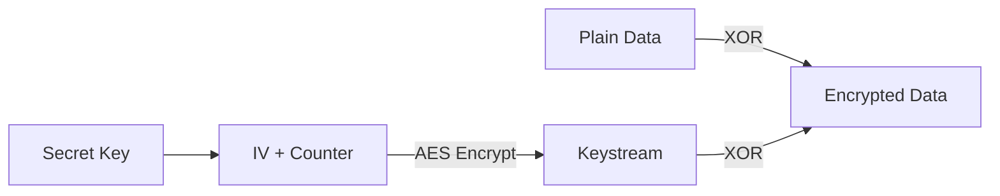

# Encryption and Security

## What is Encryption?

**Encryption** is the process of scrambling data so that only someone with the secret key can unscramble it. Think of it like:
- **Plain text**: "Hello World"
- **Encrypted**: "X%9$K@3#P..."
- Only someone with the key can turn it back to "Hello World"

## Why Do We Need It?

In a distributed file system, files travel over the network and are stored on multiple computers. Without encryption:

1. **Network sniffing**: Someone could intercept your files as they travel
2. **Unauthorized access**: Someone could read files from a node's disk
3. **Data tampering**: Someone could modify files without detection

Encryption solves all these problems!

## Core File: `crypto.go`

All cryptographic operations are in [`crypto.go`](file:///home/siddhantcvdi/codespace/distributedfilesystemgo/crypto.go).

---

## Encryption Algorithm: AES-CTR

This project uses **AES-256 in CTR mode**:

- **AES** = Advanced Encryption Standard (very secure, industry standard)
- **256** = 256-bit key (32 bytes, very strong)
- **CTR** = Counter Mode (turns AES into a stream cipher)

### What is CTR Mode?

In CTR (Counter) mode:
1. Generate a random **Initialization Vector (IV)**
2. Encrypt the IV to get a keystream
3. XOR the keystream with your data



**Key properties:**
- Same key + different IV = different ciphertext
- Fast (can be parallelized)
- No padding needed (works with any data size)

---

## Core Functions

### 1. Generating Encryption Keys

```go
func newEncryptionKey() []byte {
    keyBuf := make([]byte, 32)
    io.ReadFull(rand.Reader, keyBuf)
    return keyBuf
}
```

**What's happening:**

1. **Create a 32-byte buffer:**
   ```go
   keyBuf := make([]byte, 32)  // 32 bytes = 256 bits
   ```

2. **Fill with random bytes:**
   ```go
   io.ReadFull(rand.Reader, keyBuf)
   ```
   
   `rand.Reader` is a cryptographically secure random number generator provided by Go. It uses OS-level randomness (e.g., `/dev/urandom` on Linux).

3. **Return the key:**
   ```go
   return keyBuf  // e.g., [0x3a, 0x9f, 0x2c, ...]
   ```

**Why 32 bytes?**

AES-256 requires a 256-bit key:
- 256 bits ÷ 8 bits/byte = 32 bytes

**Example output:**
```
[58 159 44 201 87 63 129 45 ... ] (32 random bytes)
```

**Important:** Each node generates its own random key at startup. Keys are **not shared** between nodes in this implementation (they're used only for local storage encryption).

---

### 2. Generating Node IDs

```go
func generateID() string {
    buf := make([]byte, 32)
    io.ReadFull(rand.Reader, buf)
    return hex.EncodeToString(buf)
}
```

Similar to key generation, but the result is converted to a hex string:

```go
buf = [58 159 44 201 ...]
hex.EncodeToString(buf) = "3a9f2cc9..."
```

**Why hex encode?**

Raw bytes aren't safe for use in:
- File paths
- Log messages
- Network protocols

Hex encoding converts to safe ASCII characters: `0-9a-f`

**Result:** A 64-character string (32 bytes × 2 hex chars per byte)

---

### 3. Hashing Keys

```go
func hashKey(key string) string {
    hash := md5.Sum([]byte(key))
    return hex.EncodeToString(hash[:])
}
```

**What's happening:**

1. **Hash the key with MD5:**
   ```go
   hash := md5.Sum([]byte(key))
   ```
   
   MD5 produces a 128-bit (16-byte) hash:
   ```
   Input:  "picture.png"
   Output: [0x4d, 0xf3, 0x2a, ...]  (16 bytes)
   ```

2. **Convert to hex:**
   ```go
   hex.EncodeToString(hash[:])  // "4df32a..." (32 characters)
   ```

**Why use MD5?**

MD5 is **not secure** for password hashing (it's too fast and has known collisions), but it's fine for:
- Creating short, consistent identifiers
- Quick checksums
- Non-security-critical hashing

We use it to create a **short hash of the user's key** for network transmission.

**Example:**
```go
hashKey("picture.png")  // "4df32abc123..."
hashKey("document.pdf") // "9a2c5def456..."
```

---

## The Core: Stream Encryption/Decryption

### Understanding XOR Encryption

CTR mode uses XOR (exclusive OR) to encrypt data:

```
Plain:     01101000  (h)
Keystream: 11001011
           --------  XOR
Encrypted: 10100011

Encrypted: 10100011
Keystream: 11001011
           --------  XOR
Plain:     01101000  (h) ← Back to original!
```

**Key property:** `(A XOR B) XOR B = A`

This means encryption and decryption are **the same operation**!

### The copyStream Function

```go
func copyStream(stream cipher.Stream, blockSize int, src io.Reader, dst io.Writer) (int, error) {
    var (
        buf = make([]byte, 32*1024)
        nw  = blockSize
    )
    
    for {
        n, err := src.Read(buf)
        if n > 0 {
            stream.XORKeyStream(buf, buf[:n])
            nn, err := dst.Write(buf[:n])
            if err != nil {
                return 0, err
            }
            nw += nn
        }
        if err == io.EOF {
            break
        }
        if err != nil {
            return 0, err
        }
    }
    
    return nw, nil
}
```

This is the **core encryption/decryption logic**. Let's break it down:

#### Step 1: Initialize Buffer

```go
buf = make([]byte, 32*1024)  // 32 KB buffer
nw  = blockSize              // Total bytes written (starts with IV size)
```

**Why 32 KB?**
- Large enough for efficient I/O
- Small enough to not waste memory
- Standard size for buffered operations

#### Step 2: Read→Encrypt→Write Loop

```go
for {
    // Read up to 32 KB from source
    n, err := src.Read(buf)
    
    if n > 0 {
        // Encrypt/decrypt the data IN PLACE
        stream.XORKeyStream(buf, buf[:n])
        
        // Write encrypted data to destination
        nn, err := dst.Write(buf[:n])
        if err != nil {
            return 0, err
        }
        
        // Track bytes written
        nw += nn
    }
    
    // Check if we've reached the end
    if err == io.EOF {
        break
    }
    
    // Check for other errors
    if err != nil {
        return 0, err
    }
}
```

**Key insight:** `stream.XORKeyStream(buf, buf[:n])`

This modifies `buf` **in place**:
```go
Before: buf = [0x48, 0x65, 0x6c, 0x6c, 0x6f]  // "Hello"
After:  buf = [0xa3, 0xc1, 0x2d, 0x89, 0xf5]  // Encrypted
```

The same buffer serves as both input and output!

#### Step 3: Return Total Bytes Written

```go
return nw, nil
```

This includes:
- The block size (IV size, typically 16 bytes)
- All data bytes

---

### Encrypting Data: copyEncrypt

```go
func copyEncrypt(key []byte, src io.Reader, dst io.Writer) (int, error) {
    // Create AES cipher block
    block, err := aes.NewCipher(key)
    if err != nil {
        return 0, err
    }
    
    // Generate random IV
    iv := make([]byte, block.BlockSize())  // 16 bytes for AES
    if _, err := io.ReadFull(rand.Reader, iv); err != nil {
        return 0, err
    }
    
    // Prepend the IV to the output
    if _, err := dst.Write(iv); err != nil {
        return 0, err
    }
    
    // Create CTR mode stream cipher
    stream := cipher.NewCTR(block, iv)
    
    // Encrypt and copy
    return copyStream(stream, block.BlockSize(), src, dst)
}
```

**Step-by-step:**

#### Step 1: Create AES Cipher

```go
block, err := aes.NewCipher(key)
```

This creates an AES cipher using the provided key (32 bytes for AES-256).

**What is a cipher block?**

A block cipher encrypts fixed-size blocks of data (16 bytes for AES). We can't use it directly for arbitrary-length data, which is why we need CTR mode.

#### Step 2: Generate Initialization Vector (IV)

```go
iv := make([]byte, block.BlockSize())    // 16 bytes
io.ReadFull(rand.Reader, iv)             // Fill with random data
```

**What is an IV?**

The IV ensures that encrypting the same data with the same key produces different ciphertext each time:

```
Encryption 1:
  Key: [same]
  IV:  [random1]
  Data: "Hello"
  Result: "X%9$K"

Encryption 2:
  Key: [same]
  IV:  [random2]  ← Different!
  Data: "Hello"
  Result: "@mL3p"  ← Different output!
```

**Why is this important?**

Without it, an attacker could detect patterns:
```
File1: "X%9$K" ← Same as File2!
File2: "X%9$K" ← Aha! These files are identical!
```

With random IVs, same plaintext → different ciphertext each time.

#### Step 3: Prepend IV to Output

```go
dst.Write(iv)
```

**Crucial:** The IV must be stored with the encrypted data so we can decrypt later!

```
Encrypted file structure:
┌──────────┬────────────────────┐
│ IV (16B) │ Encrypted Data     │
└──────────┴────────────────────┘
```

**Note:** The IV doesn't need to be secret, just **unique and unpredictable**.

#### Step 4: Create Stream Cipher

```go
stream := cipher.NewCTR(block, iv)
```

This creates a CTR-mode stream cipher that will use:
- The AES block cipher
- The random IV
- An internal counter (handled automatically)

#### Step 5: Encrypt and Copy

```go
return copyStream(stream, block.BlockSize(), src, dst)
```

Read from `src`, encrypt, write to `dst`, return byte count.

---

### Decrypting Data: copyDecrypt

```go
func copyDecrypt(key []byte, src io.Reader, dst io.Writer) (int, error) {
    // Create AES cipher block
    block, err := aes.NewCipher(key)
    if err != nil {
        return 0, err
    }
    
    // Read the IV from the input
    iv := make([]byte, block.BlockSize())
    if _, err := src.Read(iv); err != nil {
        return 0, err
    }
    
    // Create CTR mode stream cipher
    stream := cipher.NewCTR(block, iv)
    
    // Decrypt and copy
    return copyStream(stream, block.BlockSize(), src, dst)
}
```

**Almost identical to encryption!**

The key differences:

#### Step 1: Read IV Instead of Generating

```go
// Encryption: Generate random IV
iv := make([]byte, block.BlockSize())
io.ReadFull(rand.Reader, iv)
dst.Write(iv)  // Write it to output

// Decryption: Read IV from input
iv := make([]byte, block.BlockSize())
src.Read(iv)  // Read it from input
```

**Why?**

The encrypted file starts with the IV:
```
File: [IV][Encrypted Data]
       ↑
       Read this first!
```

#### Step 2: Create Stream with Same IV

```go
stream := cipher.NewCTR(block, iv)
```

By using the **same key and same IV**, we recreate the exact same keystream used during encryption!

```
Encryption keystream: 0xa3, 0xc1, 0x2d, ...
Decryption keystream: 0xa3, 0xc1, 0x2d, ...  ← Identical!
```

#### Step 3: XOR (Decrypt)

```go
copyStream(stream, block.BlockSize(), src, dst)
```

The XOR operation reverses the encryption:

```
Original:  "Hello"
           XOR keystream → "X%9$K" (encrypted)
           XOR keystream → "Hello" (decrypted)
```

---

## Complete Encryption Example

Let's encrypt the string "Hello World!":

### Encryption Process

```go
key := newEncryptionKey()         // [0x3a, 0x9f, 0x2c, ...]
plaintext := "Hello World!"
src := bytes.NewReader([]byte(plaintext))
dst := new(bytes.Buffer)

copyEncrypt(key, src, dst)

encrypted := dst.Bytes()
```

**What happens internally:**

1. **Create AES cipher:**
   ```go
   block = aes.NewCipher(key)
   ```

2. **Generate IV:**
   ```go
   iv = [0x7b, 0x3f, 0x91, 0xcd, ...]  // 16 random bytes
   ```

3. **Write IV to output:**
   ```
   dst = [0x7b, 0x3f, 0x91, 0xcd, ...]  // IV prepended
   ```

4. **Create CTR stream:**
   ```go
   stream = cipher.NewCTR(block, iv)
   ```

5. **Read and encrypt data:**
   ```
   Read "Hello World!" (12 bytes)
   XOR with keystream
   Write encrypted bytes
   ```

6. **Final output:**
   ```
   [0x7b, 0x3f, 0x91, 0xcd, ...  ← IV (16 bytes)
    0xa3, 0xc1, 0x2d, 0x89, ...] ← Encrypted "Hello World!" (12 bytes)
   └────────────────────────────┘
    Total: 28 bytes (16 + 12)
   ```

### Decryption Process

```go
src := bytes.NewReader(encrypted)
dst := new(bytes.Buffer)

copyDecrypt(key, src, dst)

decrypted := dst.String()  // "Hello World!"
```

**What happens internally:**

1. **Create AES cipher:**
   ```go
   block = aes.NewCipher(key)  // Same key as encryption
   ```

2. **Read IV from input:**
   ```go
   iv = [0x7b, 0x3f, 0x91, 0xcd, ...]  // First 16 bytes
   ```

3. **Create CTR stream:**
   ```go
   stream = cipher.NewCTR(block, iv)  // Same key + IV = same keystream!
   ```

4. **Read and decrypt data:**
   ```
   Read encrypted bytes
   XOR with keystream (decryption)
   Write decrypted bytes
   ```

5. **Result:**
   ```
   "Hello World!"
   ```

---

## Usage in the File Server

### Storing a File (with Encryption)

From [`server.go`](file:///home/siddhantcvdi/codespace/distributedfilesystemgo/server.go):

```go
func (s *FileServer) Store(key string, r io.Reader) error {
    var (
        fileBuffer = new(bytes.Buffer)
        tee        = io.TeeReader(r, fileBuffer)
    )
    
    // Write locally (unencrypted)
    size, err := s.store.Write(s.ID, key, tee)
    
    // ...broadcast metadata...
    
    // Encrypt and send to peers
    mw := io.MultiWriter(peers...)
    mw.Write([]byte{p2p.IncomingStream})
    n, err := copyEncrypt(s.EncKey, fileBuffer, mw)
    
    return nil
}
```

**What's happening:**

1. **Local storage** (unencrypted):
   ```go
   s.store.Write(s.ID, key, tee)
   ```
   
   Files are stored **unencrypted** locally. This allows:
   - Faster access
   - Ability to serve files without decryption overhead
   - The local disk is assumed to be secure

2. **Network transmission** (encrypted):
   ```go
   copyEncrypt(s.EncKey, fileBuffer, mw)
   ```
   
   Files are **encrypted** before sending over the network. This ensures:
   - Confidentiality during transmission
   - Protection from network sniffing

### Receiving a File (with Decryption)

```go
func (s *FileServer) handleMessageStoreFile(from string, msg MessageStoreFile) error {
    peer := s.peers[from]
    
    // Receive encrypted file and decrypt while writing
    n, err := s.store.WriteDecrypt(s.EncKey, msg.ID, msg.Key, io.LimitReader(peer, msg.Size))
    
    return nil
}
```

**Flow:**

```
Network (encrypted) → WriteDecrypt → Disk (unencrypted)
```

The file is decrypted **on the fly** as it's being written to disk.

---

## Security Considerations

### What This Protects Against

✅ **Network eavesdropping:** Files are encrypted in transit
✅ **Tamper detection:** Corrupted files won't decrypt properly
✅ **Confidentiality:** Files can't be read without the encryption key

### What This Doesn't Protect Against

❌ **Local disk access:** Files are stored unencrypted locally
❌ **Key compromise:** If an attacker gets the key, all files are exposed
❌ **Authentication:** No verification of who you're communicating with
❌ **Replay attacks:** An attacker could resend captured encrypted packets

### Potential Improvements

1. **Encrypt local storage:**
   ```go
   // Instead of:
   s.store.Write(s.ID, key, data)
   
   // Do:
   encryptedData := encrypt(data, s.EncKey)
   s.store.Write(s.ID, key, encryptedData)
   ```

2. **Shared encryption keys:**
   Use a key exchange protocol (e.g., Diffie-Hellman) so all nodes can decrypt each other's files.

3. **Authentication:**
   Add HMAC (Hash-based Message Authentication Code) to verify file integrity and authenticity.

4. **Key rotation:**
   Periodically generate new encryption keys to limit exposure.

5. **Use authenticated encryption:**
   Switch to AES-GCM (Galois/Counter Mode) which combines encryption and authentication.

---

## Common Questions

### Q: Why use CTR mode instead of CBC or GCM?

**A:** 

**CTR mode:**
- ✅ Can process blocks in parallel (fast)
- ✅ No padding required
- ❌ No built-in authentication

**CBC mode:**
- ❌ Sequential (slower)
- ❌ Requires padding
- ❌ No authentication

**GCM mode:**
- ✅ Fast
- ✅ Includes authentication (prevents tampering)
- ✅ Industry standard
- ❌ More complex to implement

CTR is simple and fast, suitable for this educational project. Production systems should use GCM.

### Q: Why is the IV prepended to the encrypted data?

**A:** We need the IV to decrypt the data later. There are three common approaches:

1. **Prepend IV** (what we do):
   ```
   File: [IV][Encrypted Data]
   ```
   Simple, but adds 16 bytes to every file.

2. **Store IV separately:**
   ```
   Data file:      [Encrypted Data]
   Metadata file:  {"iv": "...", "size": ...}
   ```
   More complex, but separates concerns.

3. **Derive IV from key:**
   ```
   IV = SHA-256(key + file_hash)
   ```
   No storage needed, but reusing IVs is dangerous.

Prepending is the simplest and most common approach.

### Q: Can different nodes decrypt each other's files?

**A:** No, not in this implementation. Each node generates its own random key:

```go
// main.go
s1 := makeServer(":3000", "")  // Random EncKey
s2 := makeServer(":7000", "")  // Different random EncKey
```

Node 1 can't decrypt files from Node 2, and vice versa!

**How to fix:** Use a shared key or implement a key exchange protocol.

### Q: Is MD5 secure for hashing?

**A:** No, MD5 is not secure for cryptographic purposes:
- Known collision attacks
- Too fast (vulnerable to brute force)

But it's fine for **non-security-critical** uses like creating short identifiers. For security, use SHA-256:

```go
func hashKey(key string) string {
    hash := sha256.Sum256([]byte(key))
    return hex.EncodeToString(hash[:])
}
```

### Q: What if someone modifies the encrypted file?

**A:** The file will likely fail to decrypt properly, resulting in garbage data:

```
Original:  "Hello World"
Encrypted: [IV][0xa3, 0xc1, 0x2d, ...]
Tampered:  [IV][0xFF, 0xc1, 0x2d, ...]  ← Modified
Decrypted: "Øello World"  ← Corrupted!
```

However, there's no **explicit detection** of tampering. To detect modifications, use authenticated encryption (like AES-GCM) or add an HMAC.

---

## Summary

The encryption layer provides:

1. **AES-256-CTR encryption** for strong security
2. **Random key generation** for each node
3. **Random IVs** for each encryption operation
4. **Stream processing** for efficient handling of large files
5. **Transparent encryption/decryption** during network transmission

**Security model:**
- Files are **encrypted** over the network
- Files are **unencrypted** on local disk
- Each node has its own encryption key

This provides a good balance of security and performance for an educational distributed file system!
