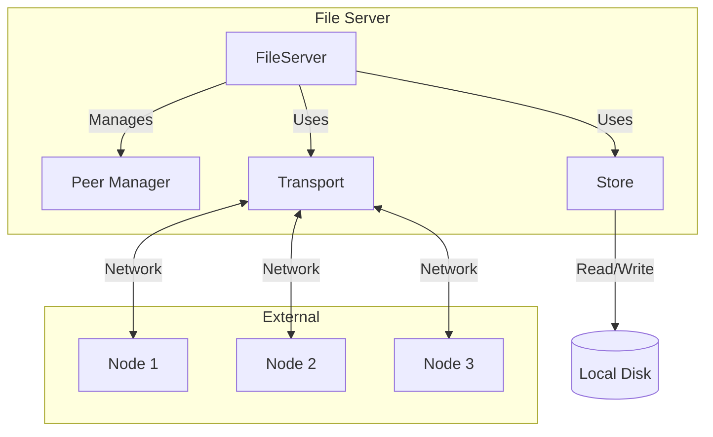
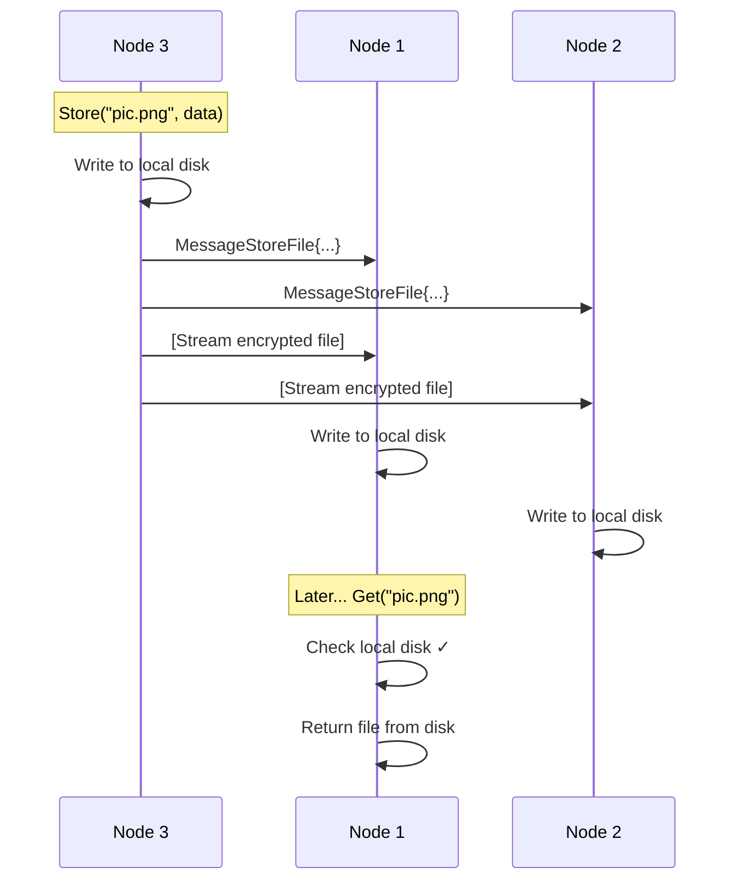
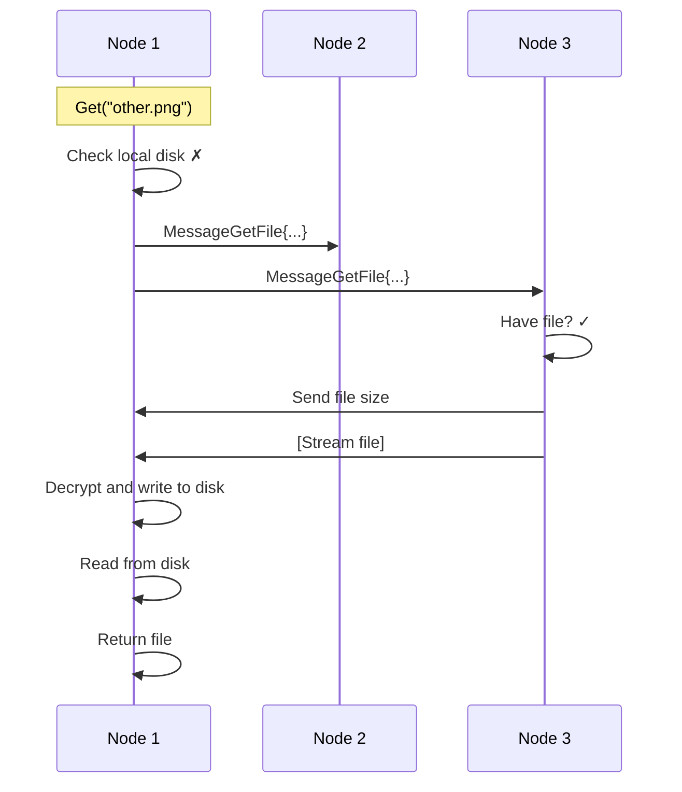

# File Server - The Heart of the System

## What is the File Server?

The **File Server** is the main orchestrator that brings together all the components:
- P2P networking (communication between nodes)
- Storage system (organizing files on disk)
- Encryption (securing data)

Think of it as the "brain" that coordinates everything.

## Core File: `server.go`

All file server logic is in [`server.go`](file:///home/siddhantcvdi/codespace/distributedfilesystemgo/server.go).

---

## Architecture Overview



---

## Data Structures

### FileServerOpts

Configuration for creating a file server:

```go
type FileServerOpts struct {
    ID                string              // Optional: unique node ID
    EncKey            []byte              // Encryption key (32 bytes)
    StorageRoot       string              // Where to store files
    PathTransformFunc PathTransformFunc   // How to organize files
    Transport         p2p.Transport       // Network layer
    BootstrapNodes    []string            // Initial nodes to connect to
}
```

Let's examine each field:

#### ID (Node Identifier)

```go
ID: "abc123def456..."  // 64-character hex string
```

**Purpose:** Uniquely identifies this node in the network.

**If not provided:** Generated automatically using `generateID()`:
```go
if len(opts.ID) == 0 {
    opts.ID = generateID()  // Random 64-char hex string
}
```

**Used for:**
- Organizing files on disk: `{Root}/{ID}/...`
- Identifying which node owns which files
- Logging and debugging

#### EncKey (Encryption Key)

```go
EncKey: [0x3a, 0x9f, 0x2c, ...]  // 32 random bytes
```

**Purpose:** The secret key used for encrypting files during network transmission.

**Generated by:** `newEncryptionKey()` in the main function

**Security:** Each node has its own key, so nodes can't decrypt each other's traffic (in this implementation).

#### StorageRoot

```go
StorageRoot: ":3000_network"
```

**Purpose:** The root directory where all files are stored.

**Naming convention:** Typically `{listenAddr}_network`
- Node on `:3000` → stores files in `:3000_network/`
- Node on `:7000` → stores files in `:7000_network/`

This ensures different nodes don't interfere with each other when running on the same machine.

#### PathTransformFunc

```go
PathTransformFunc: CASPathTransformFunc
```

**Purpose:** Determines how to convert a file key to a storage path.

**Options:**
- `CASPathTransformFunc`: Content-addressable storage (hash-based)
- `DefaultPathTransformFunc`: Use the key as-is
- Custom function: Create your own organization scheme

#### Transport

```go
Transport: p2p.NewTCPTransport(opts)
```

**Purpose:** The network communication layer.

**Must implement:** `p2p.Transport` interface
- `Dial(addr)`: Connect to a peer
- `ListenAndAccept()`: Accept incoming connections
- `Consume()`: Receive messages
- `Close()`: Shutdown

#### BootstrapNodes

```go
BootstrapNodes: []string{":3000", ":7000"}
```

**Purpose:** List of nodes to connect to when starting up.

**Empty string:** Ignored (allows easy code like `[]string{""}` for standalone nodes)

**Example:**
```go
// Standalone node (no connections)
BootstrapNodes: []string{}

// Connect to two existing nodes
BootstrapNodes: []string{":3000", ":7000"}
```

---

### FileServer

The main server structure:

```go
type FileServer struct {
    FileServerOpts                    // Embedded configuration
    
    peerLock sync.Mutex               // Protects peer map
    peers    map[string]p2p.Peer      // Connected peers
    
    store  *Store                     // File storage
    quitch chan struct{}              // Shutdown signal
}
```

#### Embedded FileServerOpts

```go
FileServerOpts  // Embedded (not a named field)
```

**Embedding** means the FileServer has direct access to all FileServerOpts fields:

```go
func (s *FileServer) example() {
    fmt.Println(s.ID)           // Direct access
    fmt.Println(s.StorageRoot)  // Direct access
    // No need for s.opts.ID
}
```

#### Peer Map

```go
peers map[string]p2p.Peer
```

**Key:** Peer's remote address (e.g., `"127.0.0.1:3000"`)
**Value:** The peer connection

**Example:**
```go
peers = {
    "127.0.0.1:3000": TCPPeer{...},
    "127.0.0.1:7000": TCPPeer{...},
}
```

**Thread safety:** Access is protected by `peerLock`:
```go
s.peerLock.Lock()
defer s.peerLock.Unlock()
s.peers[addr] = peer
```

**Why mutex?** Multiple goroutines may add/remove peers simultaneously. Without synchronization, this would cause race conditions.

#### Store

```go
store *Store
```

A pointer to the storage system (manages file I/O).

#### Quit Channel

```go
quitch chan struct{}
```

**Purpose:** Signal the server to shut down.

**Why `struct{}`?** It uses zero memory:
```go
sizeof(struct{}) = 0 bytes
sizeof(int)      = 8 bytes (waste of memory if we don't need the value)
```

**Usage:**
```go
// To shutdown:
close(s.quitch)

// In the event loop:
case <-s.quitch:
    return  // Exit
```

---

## Constructor

```go
func NewFileServer(opts FileServerOpts) *FileServer {
    storeOpts := StoreOpts{
        Root:              opts.StorageRoot,
        PathTransformFunc: opts.PathTransformFunc,
    }
    
    if len(opts.ID) == 0 {
        opts.ID = generateID()
    }
    
    return &FileServer{
        FileServerOpts: opts,
        store:          NewStore(storeOpts),
        quitch:         make(chan struct{}),
        peers:          make(map[string]p2p.Peer),
    }
}
```

**Steps:**

1. **Create store configuration:**
   ```go
   storeOpts := StoreOpts{
       Root:              opts.StorageRoot,
       PathTransformFunc: opts.PathTransformFunc,
   }
   ```

2. **Generate ID if not provided:**
   ```go
   if len(opts.ID) == 0 {
       opts.ID = generateID()
   }
   ```

3. **Create and return FileServer:**
   ```go
   return &FileServer{
       FileServerOpts: opts,
       store:          NewStore(storeOpts),
       quitch:         make(chan struct{}),
       peers:          make(map[string]p2p.Peer),
   }
   ```

---

## Message Types

The server communicates with peers using two message types:

### Message

```go
type Message struct {
    Payload any  // Can be any type
}
```

**Purpose:** Wrapper for all message payloads.

**Encoding:** Uses Go's `gob` encoding (automatically handles different types).

### MessageStoreFile

```go
type MessageStoreFile struct {
    ID   string   // Node ID that stored the file
    Key  string   // File key (hashed)
    Size int64    // File size in bytes
}
```

**Purpose:** Notify peers that we're about to send them a file.

**Example:**
```go
msg := Message{
    Payload: MessageStoreFile{
        ID:   "node123",
        Key:  "4df32abc...",  // hashKey("picture.png")
        Size: 1048592,       // ~1MB + 16 bytes IV
    },
}
```

**Flow:**
1. Node A stores a file locally
2. Node A broadcasts `MessageStoreFile` to all peers
3. Node A streams the encrypted file data
4. Peers receive the metadata, then the file data

### MessageGetFile

```go
type MessageGetFile struct {
    ID  string   // Node ID requesting the file
    Key string   // File key (hashed)
}
```

**Purpose:** Request a file from peers.

**Example:**
```go
msg := Message{
    Payload: MessageGetFile{
        ID:  "node456",
        Key: "4df32abc...",  // hashKey("picture.png")
    },
}
```

**Flow:**
1. Node A needs a file it doesn't have locally
2. Node A broadcasts `MessageGetFile` to all peers
3. Peers with the file respond by streaming it back
4. Node A receives and stores the file

---

## Core Operations

### 1. Starting the Server

```go
func (s *FileServer) Start() error {
    fmt.Printf("[%s] starting fileserver...\n", s.Transport.Addr())
    
    // Start listening for connections
    if err := s.Transport.ListenAndAccept(); err != nil {
        return err
    }
    
    // Connect to bootstrap nodes
    s.bootstrapNetwork()
    
    // Start the main event loop
    s.loop()
    
    return nil
}
```

**Steps:**

#### Step 1: Start Listening

```go
s.Transport.ListenAndAccept()
```

This tells the transport to:
- Bind to the listen address (e.g., `:3000`)
- Start accepting incoming connections
- Run in the background (doesn't block)

#### Step 2: Bootstrap

```go
s.bootstrapNetwork()
```

Connect to initial peer nodes:

```go
func (s *FileServer) bootstrapNetwork() error {
    for _, addr := range s.BootstrapNodes {
        if len(addr) == 0 {
            continue  // Skip empty addresses
        }
        
        go func(addr string) {
            fmt.Printf("[%s] attempting to connect with remote %s\n", 
                s.Transport.Addr(), addr)
            
            if err := s.Transport.Dial(addr); err != nil {
                log.Println("dial error: ", err)
            }
        }(addr)
    }
    
    return nil
}
```

**Key points:**

- Each connection is attempted in a **goroutine** (background thread)
- Failures are logged but don't stop the server
- Connections happen **concurrently** for faster startup

**Example:**
```go
BootstrapNodes: [":3000", ":7000"]

// Spawns two goroutines:
go connect(":3000")
go connect(":7000")
// Returns immediately
```

#### Step 3: Event Loop

```go
s.loop()
```

This is a **blocking call** that runs until the server shuts down.

---

### 2. The Event Loop

```go
func (s *FileServer) loop() {
    defer func() {
        log.Println("file server stopped due to error or user quit action")
        s.Transport.Close()
    }()
    
    for {
        select {
        case rpc := <-s.Transport.Consume():
            var msg Message
            if err := gob.NewDecoder(bytes.NewReader(rpc.Payload)).Decode(&msg); err != nil {
                log.Println("decoding error: ", err)
            }
            if err := s.handleMessage(rpc.From, &msg); err != nil {
                log.Println("handle message error: ", err)
            }
            
        case <-s.quitch:
            return
        }
    }
}
```

**What's happening:**

#### Defer Cleanup

```go
defer func() {
    log.Println("file server stopped...")
    s.Transport.Close()
}()
```

When the loop exits (for any reason):
1. Log a shutdown message
2. Close the transport (disconnects all peers)

#### Select Statement

```go
select {
case rpc := <-s.Transport.Consume():
    // Handle incoming message
    
case <-s.quitch:
    return  // Exit loop
}
```

**`select`** waits for one of these events:
- **Message received** from a peer
- **Quit signal** received

Whichever happens first is processed.

#### Message Handling

```go
var msg Message
gob.NewDecoder(bytes.NewReader(rpc.Payload)).Decode(&msg)
s.handleMessage(rpc.From, &msg)
```

**Steps:**
1. Create a GOB decoder from the RPC payload
2. Decode the payload into a `Message` struct
3. Handle the message based on its type

**Error handling:** Errors are logged but don't crash the server.

---

### 3. Handling Messages

```go
func (s *FileServer) handleMessage(from string, msg *Message) error {
    switch v := msg.Payload.(type) {
    case MessageStoreFile:
        return s.handleMessageStoreFile(from, v)
    case MessageGetFile:
        return s.handleMessageGetFile(from, v)
    }
    
    return nil
}
```

**Type switch:** Check the type of `msg.Payload` and route to the appropriate handler.

**Type assertion:** `v` is assigned the underlying value with the correct type:
```go
case MessageStoreFile:
    // v is now of type MessageStoreFile
    return s.handleMessageStoreFile(from, v)
```

---

### 4. Storing a File

Public method for storing files:

```go
func (s *FileServer) Store(key string, r io.Reader) error {
    var (
        fileBuffer = new(bytes.Buffer)
        tee        = io.TeeReader(r, fileBuffer)
    )
    
    // 1. Write to local storage
    size, err := s.store.Write(s.ID, key, tee)
    if err != nil {
        return err
    }
    
    // 2. Prepare metadata message
    msg := Message{
        Payload: MessageStoreFile{
            ID:   s.ID,
            Key:  hashKey(key),
            Size: size + 16,  // +16 for encryption IV
        },
    }
    
    // 3. Broadcast metadata to peers
    if err := s.broadcast(&msg); err != nil {
        return err
    }
    
    time.Sleep(time.Millisecond * 5)  // Give peers time to prepare
    
    // 4. Encrypt and stream file to all peers
    peers := []io.Writer{}
    for _, peer := range s.peers {
        peers = append(peers, peer)
    }
    mw := io.MultiWriter(peers...)
    mw.Write([]byte{p2p.IncomingStream})
    n, err := copyEncrypt(s.EncKey, fileBuffer, mw)
    if err != nil {
        return err
    }
    
    fmt.Printf("[%s] received and written (%d) bytes to disk\n", 
        s.Transport.Addr(), n)
    
    return nil
}
```

Let's break down each step:

#### Step 1: TeeReader

```go
fileBuffer = new(bytes.Buffer)
tee = io.TeeReader(r, fileBuffer)
```

**What is a TeeReader?**

It splits the read stream into two destinations:

```
       r (input)
         │
         ▼
    ┌─────────┐
    │   Tee   │
    └─────────┘
       │   │
       │   └───► fileBuffer (copy)
       │
       ▼
   s.store.Write (original destination)
```

**Why?** We need the file data twice:
1. To write to local storage
2. To send to peers

Without TeeReader, we'd have to:
```go
// Read once
data, _ := ioutil.ReadAll(r)

// Use twice
s.store.Write(s.ID, key, bytes.NewReader(data))
SendToPeers(data)
```

With TeeReader, it happens automatically in one pass!

#### Step 2: Write Locally

```go
size, err := s.store.Write(s.ID, key, tee)
```

As we read from `tee`:
- Data goes to the store
- Data is **also** copied to `fileBuffer`

After this, `fileBuffer` contains the entire file.

#### Step 3: Prepare Metadata

```go
msg := Message{
    Payload: MessageStoreFile{
        ID:   s.ID,
        Key:  hashKey(key),
        Size: size + 16,
    },
}
```

**Why `size + 16`?**

Encryption prepends a 16-byte IV:
```
Plaintext:  1000 bytes
Encrypted:  1000 + 16 = 1016 bytes
```

Peers need to know the **encrypted size** to read the correct amount.

**Why hash the key?**

Keys might be long file paths:
```
Original: "/very/long/path/to/my/file/document.pdf"
Hashed:   "4df32abc..."  (32 characters)
```

Shorter, consistent-length identifiers.

#### Step 4: Broadcast Metadata

```go
s.broadcast(&msg)
```

Send the `MessageStoreFile` to all peers:

```go
func (s *FileServer) broadcast(msg *Message) error {
    buf := new(bytes.Buffer)
    if err := gob.NewEncoder(buf).Encode(msg); err != nil {
        return err
    }
    
    for _, peer := range s.peers {
        peer.Send([]byte{p2p.IncomingMessage})
        if err := peer.Send(buf.Bytes()); err != nil {
            return err
        }
    }
    
    return nil
}
```

**Flow:**
1. Encode message with GOB
2. For each peer:
   - Send `IncomingMessage` byte (type marker)
   - Send encoded message bytes

#### Step 5: Small Delay

```go
time.Sleep(time.Millisecond * 5)
```

**Why?**

Give peers a moment to:
1. Receive the metadata
2. Prepare to receive the file stream

Without this, the file bytes might arrive before the peer is ready!

**Alternative:** Use proper synchronization (e.g., wait for ACK from peers).

#### Step 6: Prepare MultiWriter

```go
peers := []io.Writer{}
for _, peer := range s.peers {
    peers = append(peers, peer)
}
mw := io.MultiWriter(peers...)
```

**`io.MultiWriter`** duplicates writes to multiple destinations:

```
         Write(data)
              │
              ▼
        ┌──────────┐
        │MultiWriter│
        └──────────┘
         │    │    │
         ▼    ▼    ▼
       Peer1 Peer2 Peer3
```

One `Write()` call → data sent to all peers simultaneously.

#### Step 7: Stream File

```go
mw.Write([]byte{p2p.IncomingStream})  // Signal stream start
n, err := copyEncrypt(s.EncKey, fileBuffer, mw)
```

**Steps:**
1. Send `IncomingStream` byte to signal "file data incoming"
2. Encrypt file data and stream to all peers simultaneously

**Result:** All peers receive the encrypted file!

---

### 5. Receiving a File

When peers receive the `MessageStoreFile` metadata:

```go
func (s *FileServer) handleMessageStoreFile(from string, msg MessageStoreFile) error {
    peer, ok := s.peers[from]
    if !ok {
        return fmt.Errorf("peer (%s) could not be found in the peer list", from)
    }
    
    n, err := s.store.Write(msg.ID, msg.Key, io.LimitReader(peer, msg.Size))
    if err != nil {
        return err
    }
    
    fmt.Printf("[%s] written %d bytes to disk\n", s.Transport.Addr(), n)
    
    peer.CloseStream()
    
    return nil
}
```

**Flow:**

#### Step 1: Find the Peer

```go
peer, ok := s.peers[from]
```

Look up the peer by their address.

#### Step 2: Write File

```go
s.store.Write(msg.ID, msg.Key, io.LimitReader(peer, msg.Size))
```

**Key detail:** `io.LimitReader(peer, msg.Size)`

This ensures we read **exactly** `msg.Size` bytes:
```go
// Without LimitReader:
Read(peer)  // Might read too much (into next message!)

// With LimitReader:
Read(io.LimitReader(peer, 1016))  // Reads exactly 1016 bytes, then EOF
```

**Why important?**

The peer connection is a continuous stream. Without limiting, we'd read past the end of the file into the next message!

```
Stream: [FileData...][NextMessage...]
                    ↑
               Stop here!
```

#### Step 3: Close Stream

```go
peer.CloseStream()
```

Signals that the file transfer is complete (calls `WaitGroup.Done()` internally).

---

### 6. Getting a File

Public method for retrieving files:

```go
func (s *FileServer) Get(key string) (io.Reader, error) {
    // Check if we have it locally
    if s.store.Has(s.ID, key) {
        fmt.Printf("[%s] serving file (%s) from local disk\n", 
            s.Transport.Addr(), key)
        _, r, err := s.store.Read(s.ID, key)
        return r, err
    }
    
    // Don't have it, ask the network
    fmt.Printf("[%s] don't have file (%s) locally, fetching from network...\n", 
        s.Transport.Addr(), key)
    
    msg := Message{
        Payload: MessageGetFile{
            ID:  s.ID,
            Key: hashKey(key),
        },
    }
    
    if err := s.broadcast(&msg); err != nil {
        return nil, err
    }
    
    time.Sleep(time.Millisecond * 500)  // Wait for response
    
    // Read encrypted file from peers
    for _, peer := range s.peers {
        var fileSize int64
        binary.Read(peer, binary.LittleEndian, &fileSize)
        
        n, err := s.store.WriteDecrypt(s.EncKey, s.ID, key, 
            io.LimitReader(peer, fileSize))
        if err != nil {
            return nil, err
        }
        
        fmt.Printf("[%s] received (%d) bytes over the network from (%s)", 
            s.Transport.Addr(), n, peer.RemoteAddr())
        
        peer.CloseStream()
    }
    
    // Read the file we just downloaded
    _, r, err := s.store.Read(s.ID, key)
    return r, err
}
```

**Flow:**

#### Step 1: Check Local

```go
if s.store.Has(s.ID, key) {
    _, r, err := s.store.Read(s.ID, key)
    return r, err
}
```

If we already have it, just read and return!

#### Step 2: Broadcast Request

```go
msg := Message{
    Payload: MessageGetFile{
        ID:  s.ID,
        Key: hashKey(key),
    },
}
s.broadcast(&msg)
```

Ask all peers: "Who has this file?"

#### Step 3: Wait for Response

```go
time.Sleep(time.Millisecond * 500)
```

**Crude but functional:** Wait for peers to respond.

**Better approach:** Use a channel to wait for the actual response:
```go
responseCh := make(chan FileResponse)
// ... wait for response on channel ...
```

#### Step 4: Receive File

```go
for _, peer := range s.peers {
    var fileSize int64
    binary.Read(peer, binary.LittleEndian, &fileSize)
    
    n, err := s.store.WriteDecrypt(s.EncKey, s.ID, key, 
        io.LimitReader(peer, fileSize))
    
    peer.CloseStream()
}
```

**Steps:**
1. Read file size (8 bytes, little-endian int64)
2. Read and decrypt the file
3. Close the stream

**Note:** This loops through all peers, but in practice, only one peer will send the file. The others will have nothing to send. A better implementation would handle this more gracefully.

#### Step 5: Read Downloaded File

```go
_, r, err := s.store.Read(s.ID, key)
return r, err
```

Now that we've downloaded the file, read it from local storage and return it!

---

### 7. Serving a File Request

When a peer requests a file we have:

```go
func (s *FileServer) handleMessageGetFile(from string, msg MessageGetFile) error {
    // Check if we have the file
    if !s.store.Has(msg.ID, msg.Key) {
        return fmt.Errorf("[%s] need to serve file (%s) but it does not exist on disk", 
            s.Transport.Addr(), msg.Key)
    }
    
    fmt.Printf("[%s] serving file (%s) over the network\n", 
        s.Transport.Addr(), msg.Key)
    
    // Read the file
    fileSize, r, err := s.store.Read(msg.ID, msg.Key)
    if err != nil {
        return err
    }
    
    // Close reader if needed
    if rc, ok := r.(io.ReadCloser); ok {
        defer rc.Close()
    }
    
    // Find the requesting peer
    peer, ok := s.peers[from]
    if !ok {
        return fmt.Errorf("peer %s not in map", from)
    }
    
    // Send stream marker and file size
    peer.Send([]byte{p2p.IncomingStream})
    binary.Write(peer, binary.LittleEndian, fileSize)
    
    // Stream the file
    n, err := io.Copy(peer, r)
    if err != nil {
        return err
    }
    
    fmt.Printf("[%s] written (%d) bytes over the network to %s\n", 
        s.Transport.Addr(), n, from)
    
    return nil
}
```

**Flow:**

#### Step 1: Verify File Exists

```go
if !s.store.Has(msg.ID, msg.Key) {
    return fmt.Errorf("file does not exist")
}
```

#### Step 2: Read File

```go
fileSize, r, err := s.store.Read(msg.ID, msg.Key)
```

Get the file size and a reader.

#### Step 3: Send File Size

```go
peer.Send([]byte{p2p.IncomingStream})
binary.Write(peer, binary.LittleEndian, fileSize)
```

**Why send size first?**

The receiver needs to know how many bytes to read:
```go
// Receiver:
var fileSize int64
binary.Read(peer, binary.LittleEndian, &fileSize)
io.Copy(destination, io.LimitReader(peer, fileSize))
```

**Binary encoding:** Converts the int64 to 8 bytes:
```
fileSize = 1048576
Binary:  [0x00, 0x10, 0x00, 0x00, 0x00, 0x00, 0x00, 0x00]
```

**Little-endian:** Least significant byte first (standard on x86 processors).

#### Step 4: Stream File

```go
io.Copy(peer, r)
```

Read from file, write to peer connection.

---

### 8. Peer Management

When a new peer connects:

```go
func (s *FileServer) OnPeer(p p2p.Peer) error {
    s.peerLock.Lock()
    defer s.peerLock.Unlock()
    
    s.peers[p.RemoteAddr().String()] = p
    
    log.Printf("connected with remote %s", p.RemoteAddr())
    
    return nil
}
```

**Thread-safe:** Uses mutex to protect the peer map.

**Callback:** This is set as the transport's `OnPeer` callback:
```go
tcpTransport.OnPeer = s.OnPeer
```

So whenever the transport accepts a new peer, this function is called automatically!

---

## Complete Example: Storing and Retrieving

### Scenario: 3 nodes, Node 3 stores a file



### Scenario: Node 1 requests a file it doesn't have



---

## Initialization

At startup, message types are registered with GOB:

```go
func init() {
    gob.Register(MessageStoreFile{})
    gob.Register(MessageGetFile{})
}
```

**Why?**

GOB needs to know about custom types for encoding/decoding:
```go
msg := Message{Payload: MessageStoreFile{...}}
gob.Encode(msg)  // Needs to know about MessageStoreFile
```

**`init()`** functions run automatically before `main()`.

---

## Summary

The FileServer is the orchestrator that:

1. **Manages peers** - keeps track of connected nodes
2. **Stores files** - writes locally and replicates to peers
3. **Retrieves files** - from local storage or the network
4. **Handles messages** - routes different message types appropriately
5. **Coordinates components** - brings together transport, storage, and encryption

**Key design patterns:**
- **Event-driven:** Main loop processes events (messages and quit signal)
- **Concurrent:** Multiple goroutines handle different aspects
- **Modular:** Clear separation between networking, storage, and business logic

The server is the glue that makes the distributed file system work!
