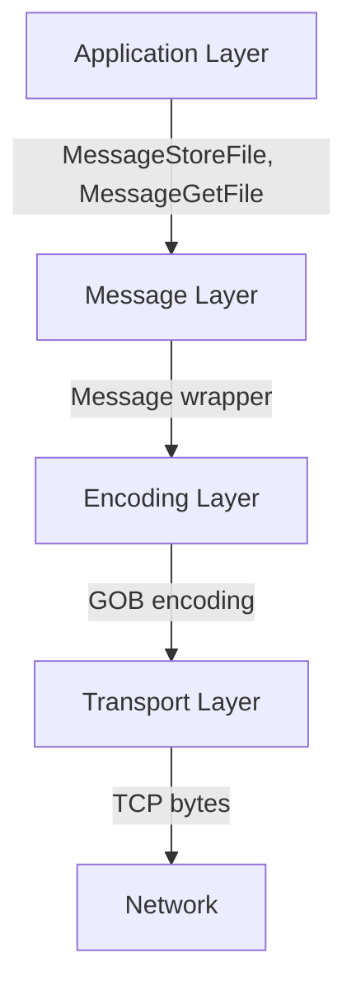
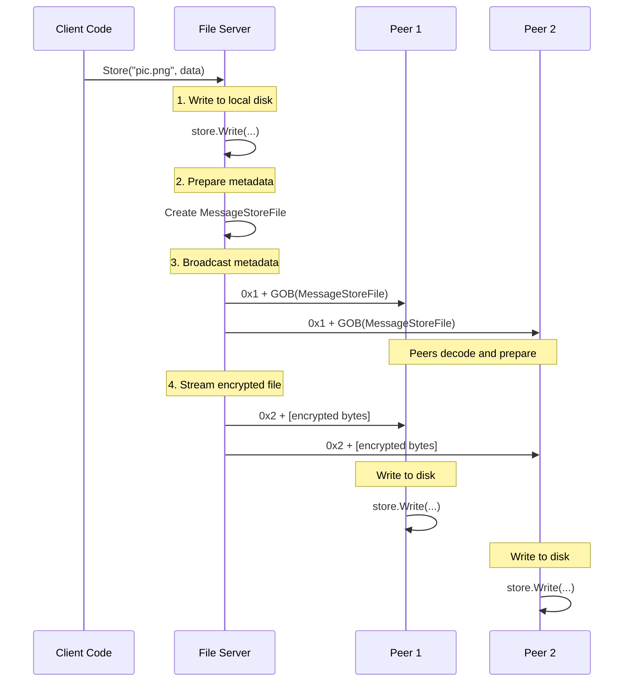
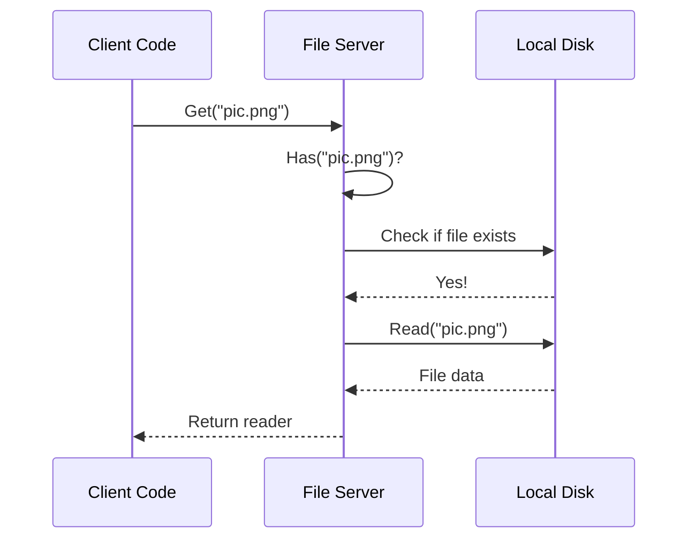
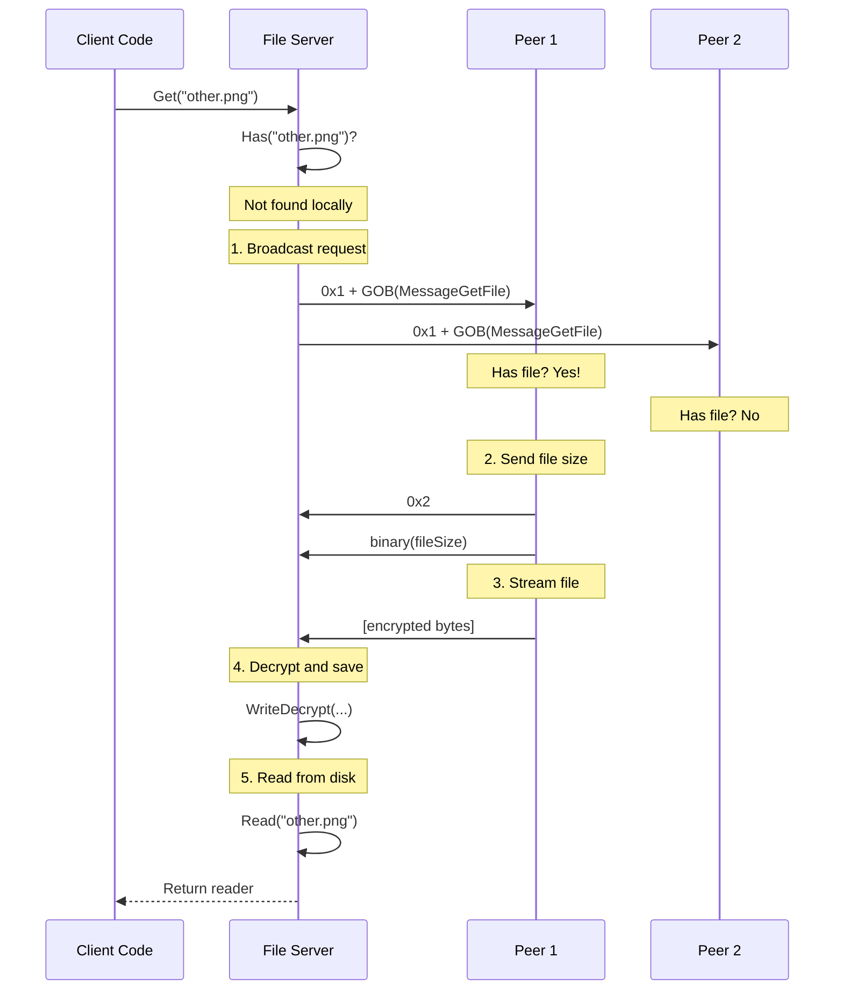
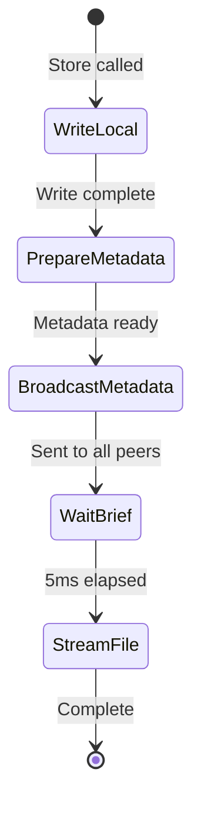
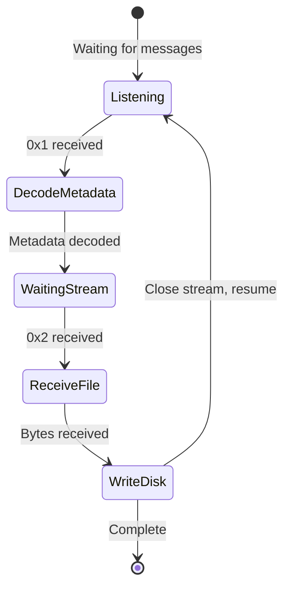

# Message Protocol - Communication Between Nodes

## What is a Protocol?

A **protocol** is a set of rules that defines how two parties communicate. Think of it like:
- **Language:** English vs Spanish vs Chinese
- **Format:** Email vs Text message vs Phone call
- **Structure:** "Hello, how are you?" vs "what u doin"

In our distributed file system, the protocol defines:
- How messages are formatted
- What types of messages exist
- How messages are sent and received
- How to distinguish between different message types

---

## Protocol Layers

Our system has a layered protocol:



Let's examine each layer:

---

## Transport Layer Protocol

### Byte Stream Structure

Everything sent over TCP is just **bytes**. Here's how we structure them:

```
┌──────────┬───────────────┐
│ Type (1B)│ Payload (var) │
└──────────┴───────────────┘
```

### Message Type Byte

The first byte indicates what follows:

```go
const (
    IncomingMessage = 0x1  // Regular message follows
    IncomingStream  = 0x2  // File stream follows
)
```

**Examples:**

#### Regular Message
```
┌────┬────────────────────────┐
│0x1 │ [GOB-encoded message]  │
└────┴────────────────────────┘
  1B        Variable size
```

#### File Stream
```
┌────┬─────────────────────────┐
│0x2 │ [Raw file bytes]        │
└────┴─────────────────────────┘
  1B      Variable size
```

---

## Message Layer Protocol

### Message Envelope

All application messages are wrapped in a `Message` struct:

```go
type Message struct {
    Payload any  // Can be any registered type
}
```

**Encoding:** Uses Go's `encoding/gob` for serialization.

**Example:**
```go
msg := Message{
    Payload: MessageStoreFile{
        ID:   "node123",
        Key:  "abc123",
        Size: 1024,
    },
}

// Encode to bytes
buf := new(bytes.Buffer)
gob.NewEncoder(buf).Encode(msg)
// buf now contains encoded bytes
```

---

## Application Layer Protocol

### Message Types

The application uses two message types:

#### 1. MessageStoreFile

**Purpose:** Announce that a file is about to be sent.

```go
type MessageStoreFile struct {
    ID   string   // Node that owns the file
    Key  string   // File identifier (hashed)
    Size int64    // File size in bytes (encrypted)
}
```

**When sent:**
- Before streaming a file to peers
- After storing a file locally

**What the receiver does:**
1. Prepare to receive a file
2. Wait for the stream to arrive
3. Write the file to disk

**Example:**
```go
msg := Message{
    Payload: MessageStoreFile{
        ID:   "node_abc123",
        Key:  "4df32abc...",  // hashKey("picture.png")
        Size: 1048592,       // 1MB + 16 bytes IV
    },
}
```

#### 2. MessageGetFile

**Purpose:** Request a file from peers.

```go
type MessageGetFile struct {
    ID  string   // Node requesting the file
    Key string   // File identifier (hashed)
}
```

**When sent:**
- When trying to retrieve a file not available locally

**What the receiver does:**
1. Check if they have the requested file
2. If yes, stream it back to the requester
3. If no, ignore the request

**Example:**
```go
msg := Message{
    Payload: MessageGetFile{
        ID:  "node_def456",
        Key: "4df32abc...",  // hashKey("picture.png")
    },
}
```

---

## Complete Protocol Workflows

### Workflow 1: Storing a File



**Byte-level view:**

```
Connection to Peer 1:
┌────────────────────────────────────┐
│ Step 3: Send metadata              │
├────┬───────────────────────────────┤
│0x1 │ GOB(MessageStoreFile{...})    │
└────┴───────────────────────────────┘

┌────────────────────────────────────┐
│ Step 4: Stream file                │
├────┬───────────────────────────────┤
│0x2 │ [IV][encrypted file data]     │
└────┴───────────────────────────────┘
```

### Workflow 2: Retrieving a File (Local)



**No network communication needed!**

### Workflow 3: Retrieving a File (Network)



**Byte-level view:**

```
Sending request to peers:
┌────┬───────────────────────────────┐
│0x1 │ GOB(MessageGetFile{...})      │
└────┴───────────────────────────────┘

Receiving file from Peer 1:
┌────┬───────────────────────────────┐
│0x2 │ 0x00 0x00 0x00 0x00 0x00 0x10 │ <- File size (little-endian int64)
│    │ [IV][encrypted file data...]  │ <- Encrypted file
└────┴───────────────────────────────┘
```

---

## Protocol Details

### 1. GOB Encoding

**What is GOB?**

GOB is Go's binary encoding format. It:
- Serializes Go data structures to bytes
- Deserializes bytes back to Go data structures
- Handles different types automatically
- Is efficient and fast

**Example:**

```go
// Encoding
data := MessageStoreFile{
    ID:   "node123",
    Key:  "abc",
    Size: 1024,
}

buf := new(bytes.Buffer)
encoder := gob.NewEncoder(buf)
encoder.Encode(data)

// buf.Bytes() = [0x0e, 0xff, 0x81, 0x03, 0x01, ...]
```

```go
// Decoding
var received MessageStoreFile
decoder := gob.NewDecoder(buf)
decoder.Decode(&received)

// received = MessageStoreFile{ID: "node123", Key: "abc", Size: 1024}
```

**Important:** Both sides must know the data structure!

### 2. Type Registration

Before using GOB with custom types, they must be registered:

```go
func init() {
    gob.Register(MessageStoreFile{})
    gob.Register(MessageGetFile{})
}
```

**Why?**

GOB uses reflection to serialize data. Registration tells GOB:
- What types to expect
- How to encode/decode them

Without registration:
```go
gob.Encode(Message{Payload: MessageStoreFile{...}})
// Error: type not registered!
```

### 3. Binary Encoding for File Size

```go
binary.Write(peer, binary.LittleEndian, fileSize)
```

**What's happening:**

Convert an `int64` to 8 bytes:

```
fileSize = 1048576  (1 MB)

Binary representation (little-endian):
[0x00, 0x10, 0x00, 0x00, 0x00, 0x00, 0x00, 0x00]
  ↑     ↑
  LSB  MSB
```

**Reading it back:**

```go
var fileSize int64
binary.Read(peer, binary.LittleEndian, &fileSize)
// fileSize = 1048576
```

**Why not use GOB?**

Binary encoding is:
- Fixed size (always 8 bytes for int64)
- Faster (no overhead)
- Simpler for primitive types

---

## Message Flow Diagrams

### Broadcasting vs Point-to-Point

#### Broadcasting (Store File)

```
           Server
           /  |  \
          /   |   \
         /    |    \
      Peer1 Peer2 Peer3

All peers receive the same message!
```

**Code:**
```go
func (s *FileServer) broadcast(msg *Message) error {
    buf := new(bytes.Buffer)
    gob.NewEncoder(buf).Encode(msg)
    
    for _, peer := range s.peers {
        peer.Send([]byte{p2p.IncomingMessage})
        peer.Send(buf.Bytes())
    }
    
    return nil
}
```

#### Point-to-Point (Get File Response)

```
  Server <-----> Peer2

Only Peer2 sends the file
```

**Code:**
```go
func (s *FileServer) handleMessageGetFile(from string, msg MessageGetFile) error {
    peer := s.peers[from]  // Only this peer
    
    peer.Send([]byte{p2p.IncomingStream})
    binary.Write(peer, binary.LittleEndian, fileSize)
    io.Copy(peer, fileReader)
    
    return nil
}
```

---

## Protocol State Machines

### Sender State Machine (Store File)



### Receiver State Machine (Store File)



---

## Error Handling

### Network Errors

```go
func (s *FileServer) broadcast(msg *Message) error {
    for _, peer := range s.peers {
        if err := peer.Send(buf.Bytes()); err != nil {
            return err  // Stop on first error
        }
    }
    return nil
}
```

**Issue:** If one peer fails, others don't receive the message!

**Better approach:**
```go
func (s *FileServer) broadcast(msg *Message) error {
    var errors []error
    
    for addr, peer := range s.peers {
        if err := peer.Send(buf.Bytes()); err != nil {
            log.Printf("Failed to send to %s: %v", addr, err)
            errors = append(errors, err)
        }
    }
    
    if len(errors) > 0 {
        return fmt.Errorf("failed to send to %d peers", len(errors))
    }
    
    return nil
}
```

### Decoding Errors

```go
var msg Message
if err := gob.NewDecoder(bytes.NewReader(rpc.Payload)).Decode(&msg); err != nil {
    log.Println("decoding error: ", err)
    // Continue processing other messages
}
```

**Current behavior:** Log and ignore

**Better approach:** 
- Send error response to sender
- Track malformed messages
- Disconnect peers sending invalid data

---

## Protocol Limitations

### 1. No Acknowledgments

**Issue:** Sender doesn't know if messages were received.

```go
s.broadcast(&msg)  // Fire and forget!
```

**Solution:** Add ACK messages:
```go
type MessageAck struct {
    MessageID string
    Success   bool
}
```

### 2. No Message IDs

**Issue:** Can't correlate requests and responses.

**Solution:** Add unique IDs:
```go
type Message struct {
    ID      string  // Unique message ID
    Payload any
}
```

### 3. Crude Timing

**Issue:** Using sleep to wait for responses:
```go
s.broadcast(&msg)
time.Sleep(500 * time.Millisecond)  // Hope response arrives!
```

**Solution:** Use channels or callbacks:
```go
responsesCh := make(chan FileResponse)
s.broadcastWithCallback(&msg, func(resp FileResponse) {
    responsesCh <- resp
})

select {
case resp := <-responsesCh:
    // Process response
case <-time.After(1 * time.Second):
    // Timeout
}
```

### 4. Inefficient Broadcast

**Issue:** Every node receives every message.

In a network with 1000 nodes:
- Store one file
- Send to 999 other nodes
- Each sends to 999 nodes = 998,001 messages!

**Solution:** Use a DHT (Distributed Hash Table) to route messages efficiently.

### 5. No Versioning

**Issue:** If we change the message format, old nodes break.

**Solution:** Add version numbers:
```go
type Message struct {
    Version int  // Protocol version
    Payload any
}
```

---

## Protocol Extensions

### Extension 1: Message Priorities

```go
type Message struct {
    Priority int  // 0=low, 1=normal, 2=high
    Payload  any
}
```

High-priority messages (e.g., heartbeats) processed first.

### Extension 2: Compression

```go
func (s *FileServer) broadcast(msg *Message) error {
    buf := new(bytes.Buffer)
    gob.NewEncoder(buf).Encode(msg)
    
    compressed := compress(buf.Bytes())  // gzip compression
    
    for _, peer := range s.peers {
        peer.Send([]byte{p2p.IncomingCompressedMessage})
        peer.Send(compressed)
    }
    
    return nil
}
```

Reduce bandwidth usage for large messages.

### Extension 3: Encryption

```go
func (s *FileServer) broadcast(msg *Message) error {
    buf := new(bytes.Buffer)
    gob.NewEncoder(buf).Encode(msg)
    
    encrypted := encrypt(buf.Bytes(), s.EncKey)
    
    for _, peer := range s.peers {
        peer.Send([]byte{p2p.IncomingEncryptedMessage})
        peer.Send(encrypted)
    }
    
    return nil
}
```

Protect message metadata in addition to file contents.

---

## Comparison with Other Protocols

### vs HTTP

| Feature | Our Protocol | HTTP |
|---------|--------------|------|
| Transport | TCP | TCP |
| Structure | Binary (GOB) | Text (headers + body) |
| Streaming | Native | Chunked transfer |
| Overhead | Low | Medium |
| Debugging | Hard | Easy (human-readable) |
| Standardization | None | RFC 7230-7235 |

### vs WebSocket

| Feature | Our Protocol | WebSocket |
|---------|--------------|-----------|
| Connection | Long-lived | Long-lived |
| Direction | Bidirectional | Bidirectional |
| Framing | Custom | Built-in |
| Browser support | No | Yes |
| Overhead | Lower | Slightly higher |

### vs gRPC

| Feature | Our Protocol | gRPC |
|---------|--------------|------|
| Encoding | GOB | Protocol Buffers |
| RPC support | Manual | Built-in |
| Streaming | Manual | Built-in |
| Language support | Go only | Multi-language |
| Learning curve | Simple | Steeper |

---

## Protocol Visualization

### Message Anatomy

```
Complete message sent over TCP:

┌─────────────────────────────────────────────────────┐
│               TCP Packet Header                     │
├─────────────────────────────────────────────────────┤
│ Message Type (1 byte)                               │
│ ┌───────────────────────────────────────────────┐   │
│ │ 0x1 = IncomingMessage                         │   │
│ │ 0x2 = IncomingStream                          │   │
│ └───────────────────────────────────────────────┘   │
├─────────────────────────────────────────────────────┤
│ Payload (variable length)                           │
│ ┌───────────────────────────────────────────────┐   │
│ │ If type = 0x1:                                │   │
│ │   GOB-encoded Message struct                  │   │
│ │   ┌───────────────────────────────────────┐   │   │
│ │   │ Payload type identifier              │   │   │
│ │   ├───────────────────────────────────────┤   │   │
│ │   │ MessageStoreFile or MessageGetFile   │   │   │
│ │   │   - ID (string)                      │   │   │
│ │   │   - Key (string)                     │   │   │
│ │   │   - Size (int64, for StoreFile)      │   │   │
│ │   └───────────────────────────────────────┘   │   │
│ │                                               │   │
│ │ If type = 0x2:                                │   │
│ │   Raw bytes (file data or file size)         │   │
│ └───────────────────────────────────────────────┘   │
└─────────────────────────────────────────────────────┘
```

---

## Summary

The message protocol provides:

1. **Simple structure:** Type byte + payload
2. **Flexible encoding:** GOB for messages, binary for primitives
3. **Two message types:** Store and Get
4. **Broadcast capability:** Send to all peers
5. **Stream support:** Efficient file transfers

**Strengths:**
- Simple and easy to understand
- Efficient for Go-to-Go communication
- Minimal overhead

**Weaknesses:**
- No acknowledgments or error handling
- No message correlation
- Language-specific (GOB only works with Go)
- No versioning or backward compatibility

**For production:** Consider using a mature protocol like gRPC or implementing a more robust custom protocol with proper error handling, versioning, and acknowledgments.
