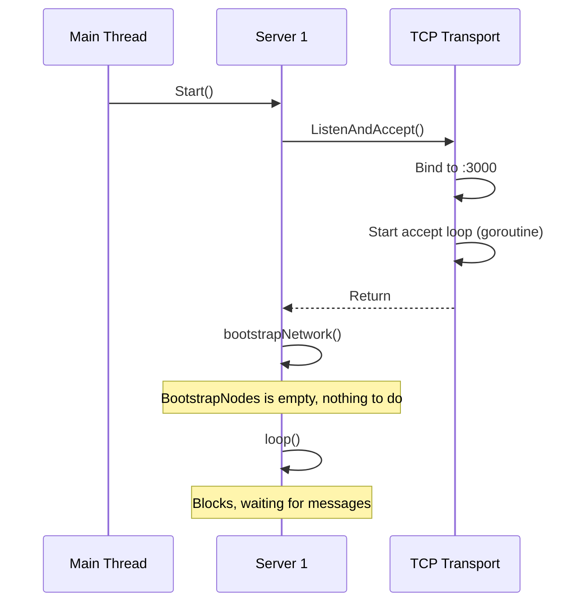
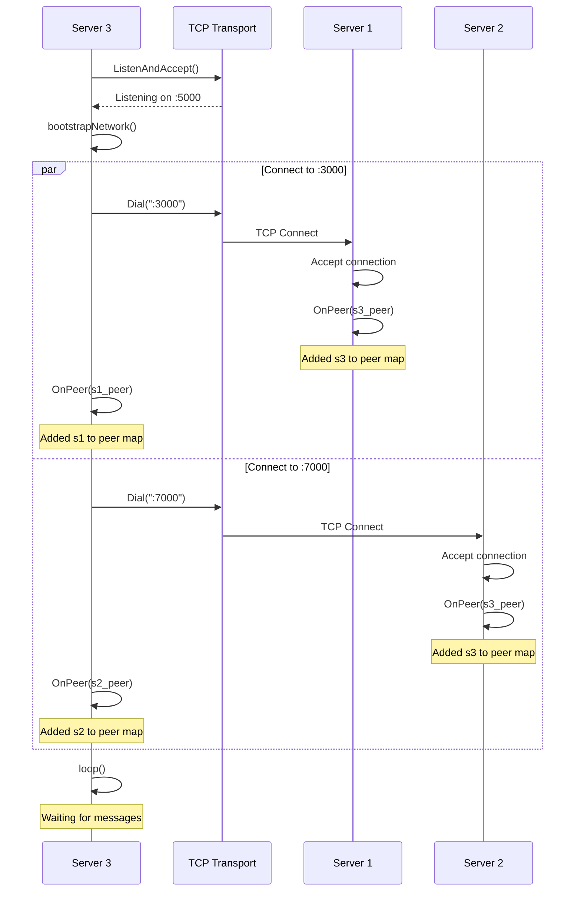
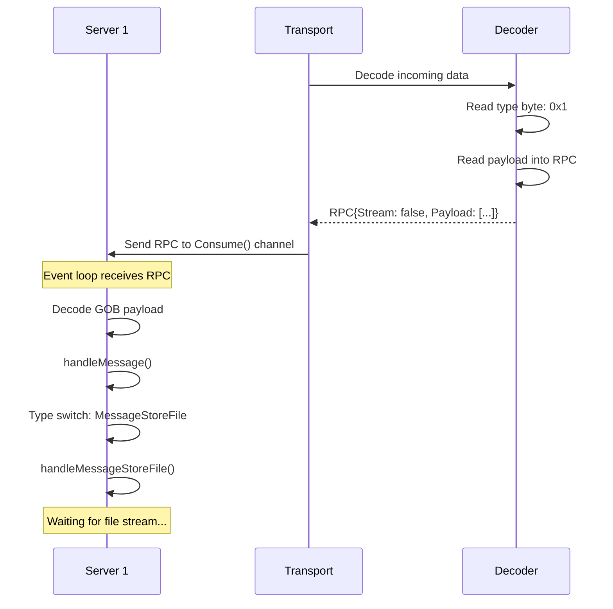

# Example Workflows - Step-by-Step Walkthroughs

This document walks through real-world scenarios to show how all components work together.

---

## Workflow 1: Starting the System

### Scenario: Starting 3 nodes from scratch

From [`main.go`](file:///home/siddhantcvdi/codespace/distributedfilesystemgo/main.go):

```go
func main() {
    s1 := makeServer(":3000", "")
    s2 := makeServer(":7000", "")
    s3 := makeServer(":5000", ":3000", ":7000")
    
    go func() { log.Fatal(s1.Start()) }()
    time.Sleep(500 * time.Millisecond)
    
    go func() { log.Fatal(s2.Start()) }()
    time.Sleep(2 * time.Second)
    
    go s3.Start()
    time.Sleep(2 * time.Second)
    
    // ... file operations ...
}
```

Let's trace what happens:

### Step 1: Creating Server 1

```go
s1 := makeServer(":3000", "")
```

**Inside makeServer:**

```go
func makeServer(listenAddr string, nodes ...string) *FileServer {
    // 1. Create TCP transport
    tcptransportOpts := p2p.TCPTransportOpts{
        ListenAddr:    ":3000",
        HandshakeFunc: p2p.NOPHandshakeFunc,
        Decoder:       p2p.DefaultDecoder{},
    }
    tcpTransport := p2p.NewTCPTransport(tcptransportOpts)
    
    // 2. Create file server options
    fileServerOpts := FileServerOpts{
        EncKey:            newEncryptionKey(),        // [0x3a, 0x9f, ...]
        StorageRoot:       ":3000_network",
        PathTransformFunc: CASPathTransformFunc,
        Transport:         tcpTransport,
        BootstrapNodes:    []string{""},             // Empty
    }
    
    // 3. Create file server
    s := NewFileServer(fileServerOpts)
    // s.ID = "abc123def456..."  (auto-generated)
    
    // 4. Wire up peer callback
    tcpTransport.OnPeer = s.OnPeer
    
    return s
}
```

**Result:**
- Server instance created (not yet running)
- Unique ID generated
- Encryption key generated
- Storage directory: `:3000_network/`
- Bootstrap nodes: none (standalone)

### Step 2: Creating Server 2

```go
s2 := makeServer(":7000", "")
```

Same process as Server 1, but:
- Listen address: `:7000`
- Storage directory: `:7000_network/`
- Different encryption key
- Different node ID

### Step 3: Creating Server 3

```go
s3 := makeServer(":5000", ":3000", ":7000")
```

Same process, but:
- Listen address: `:5000`
- Storage directory: `:5000_network/`
- Bootstrap nodes: `:3000` and `:7000` (will connect to s1 and s2)

### Step 4: Starting Server 1

```go
go func() { log.Fatal(s1.Start()) }()
```

**What happens in `s1.Start()`:**



**Console output:**
```
TCP transport listening on port: :3000
[:3000] starting fileserver...
```

**State:**
- Server 1 is listening on port 3000
- No connections yet
- Event loop running, waiting for messages

**File system:**
```
Current directory/
└── :3000_network/  (created when first file is stored)
```

### Step 5: Starting Server 2

```go
time.Sleep(500 * time.Millisecond)  // Let s1 settle
go func() { log.Fatal(s2.Start()) }()
```

Same as Server 1:
- Listening on `:7000`
- No connections (BootstrapNodes empty)

**Console output:**
```
TCP transport listening on port: :7000
[:7000] starting fileserver...
```

### Step 6: Starting Server 3

```go
time.Sleep(2 * time.Second)  // Let s1 and s2 settle
go s3.Start()
```

**Inside `s3.Start()`:**



**Console output:**
```
TCP transport listening on port: :5000
[:5000] starting fileserver...
[:5000] attempting to connect with remote :3000
[:5000] attempting to connect with remote :7000
connected with remote 127.0.0.1:5000  (from s1's perspective)
[:3000] connected with remote 127.0.0.1:5000
connected with remote 127.0.0.1:5000  (from s2's perspective)
[:7000] connected with remote 127.0.0.1:5000
```

**Network topology:**

```
    s1(:3000)
       │
       │
    s3(:5000)
       │
       │
    s2(:7000)
```

**Note:** s1 and s2 are NOT connected to each other, only to s3!

### Final State

**Servers running:**
- s1: Listening on `:3000`, 1 peer (s3)
- s2: Listening on `:7000`, 1 peer (s3)
- s3: Listening on `:5000`, 2 peers (s1, s2)

**File system:**
```
Current directory/
├── :3000_network/  (empty, will be created on first write)
├── :5000_network/  (empty)
└── :7000_network/  (empty)
```

---

## Workflow 2: Storing a File

### Scenario: s3 stores 20 files

From `main.go`:

```go
for i := 0; i < 20; i++ {
    key := fmt.Sprintf("picture_%d.png", i)
    data := bytes.NewReader([]byte("my big data file here!"))
    s3.Store(key, data)
    // ... more operations ...
}
```

Let's trace **one iteration** (i=0):

### Step 1: Call Store

```go
key := "picture_0.png"
data := bytes.NewReader([]byte("my big data file here!"))
s3.Store(key, data)
```

### Step 2: Write Locally

Inside `s3.Store()`:

```go
fileBuffer := new(bytes.Buffer)
tee := io.TeeReader(data, fileBuffer)
size, err := s3.store.Write(s3.ID, "picture_0.png", tee)
```

**What happens:**

1. **Transform key to path:**
   ```go
   pathKey := CASPathTransformFunc("picture_0.png")
   // Computes SHA-1: "0eb98d43b6e5b2b456..."
   // Splits into: "0eb98/d43b6/e5b2b/456..."
   // Filename: "0eb98d43b6e5b2b456..."
   ```

2. **Create directory structure:**
   ```go
   pathNameWithRoot := ":5000_network/{s3.ID}/0eb98/d43b6/e5b2b/456/..."
   os.MkdirAll(pathNameWithRoot, os.ModePerm)
   ```

3. **Write file:**
   ```go
   fullPath := ":5000_network/{s3.ID}/0eb98/.../0eb98d43b6e5b2b456..."
   f, _ := os.Create(fullPath)
   io.Copy(f, tee)  // Writes "my big data file here!"
   ```

4. **fileBuffer also filled:**
   ```go
   // Thanks to TeeReader, fileBuffer now contains:
   // "my big data file here!"
   ```

**File system after write:**
```
:5000_network/
  └── {s3.ID}/
      └── 0eb98/
          └── d43b6/
              └── e5b2b/
                  └── 456.../
                      └── 0eb98d43b6e5b2b456...
                          Contents: "my big data file here!"
```

**Console output:**
```
[:5000] received and written (23) bytes to disk
```

### Step 3: Broadcast Metadata

```go
msg := Message{
    Payload: MessageStoreFile{
        ID:   s3.ID,
        Key:  hashKey("picture_0.png"),  // MD5: "a1b2c3..."
        Size: 23 + 16,                    // 39 bytes (data + IV)
    },
}
s3.broadcast(&msg)
```

**What happens:**

```go
func (s *FileServer) broadcast(msg *Message) error {
    buf := new(bytes.Buffer)
    gob.NewEncoder(buf).Encode(msg)
    
    for _, peer := range s3.peers {  // s1 and s2
        peer.Send([]byte{p2p.IncomingMessage})  // 0x1
        peer.Send(buf.Bytes())
    }
}
```

**Sent to s1:**
```
Bytes: [0x1][GOB-encoded MessageStoreFile{...}]
```

**Sent to s2:**
```
Bytes: [0x1][GOB-encoded MessageStoreFile{...}]
```

**Console output:**
```
(none - silent operation)
```

### Step 4: Peers Receive Metadata

**On s1:**



**On s2:** (Same process)

### Step 5: Short Delay

```go
time.Sleep(time.Millisecond * 5)
```

Give peers time to process metadata and prepare to receive the file.

### Step 6: Stream Encrypted File

```go
peers := []io.Writer{}
for _, peer := range s3.peers {
    peers = append(peers, peer)
}
mw := io.MultiWriter(peers...)

mw.Write([]byte{p2p.IncomingStream})  // Send type byte
n, err := copyEncrypt(s3.EncKey, fileBuffer, mw)
```

**Inside copyEncrypt:**

1. **Generate IV:**
   ```go
   iv := [0x7b, 0x3f, 0x91, 0xcd, ...]  // 16 random bytes
   ```

2. **Write IV to all peers:**
   ```go
   mw.Write(iv)  // Sent to s1 and s2
   ```

3. **Encrypt and stream data:**
   ```go
   stream := cipher.NewCTR(block, iv)
   copyStream(stream, 16, fileBuffer, mw)
   // Reads "my big data file here!"
   // XORs with keystream
   // Writes encrypted bytes to s1 and s2
   ```

**Sent to s1 and s2:**
```
Bytes: [0x2][IV: 16 bytes][Encrypted: 23 bytes]
Total: 39 bytes
```

**Console output:**
```
[:5000] received and written (39) bytes to disk
```

### Step 7: Peers Receive File

**On s1:**

```go
func (s *FileServer) handleMessageStoreFile(from string, msg MessageStoreFile) error {
    peer := s1.peers[from]  // s3's connection
    
    // Note: peer stream is currently positioned after 0x2 byte
    // Ready to read: [IV][encrypted data]
    
    n, err := s1.store.Write(msg.ID, msg.Key, io.LimitReader(peer, msg.Size))
    // Reads exactly 39 bytes from peer
    // Writes to disk: :3000_network/{msg.ID}/{hash}/...
    
    fmt.Printf("[:3000] written %d bytes to disk\n", n)
    
    peer.CloseStream()
    return nil
}
```

**File system on s1:**
```
:3000_network/
  └── {s3.ID}/        ← Note: s3's ID, not s1's!
      └── a1b2c/      ← Hash of "picture_0.png"
          └── 3d4e5/
              └── ...
                  └── a1b2c3d4e5...
                      Contents: [IV][encrypted data] (still encrypted!)
```

**Console output:**
```
[:3000] written 39 bytes to disk
```

**On s2:** (Same process)

### Final State After Storing One File

**File locations:**

| Node | Path | Content | Encrypted? |
|------|------|---------|------------|
| s3 (origin) | `:5000_network/{s3.ID}/0eb98/.../` | `"my big data file here!"` | No |
| s1 (peer) | `:3000_network/{s3.ID}/a1b2c/.../` | `[IV][encrypted]` | Yes |
| s2 (peer) | `:7000_network/{s3.ID}/a1b2c/.../` | `[IV][encrypted]` | Yes |

**Key observations:**
- s3 stores plaintext locally
- s1 and s2 store encrypted copies
- All use s3's node ID in the path
- s1 and s2 use the hashed key, s3 uses SHA-1 of the key

**Total storage used:**
- s3: 23 bytes (plaintext)
- s1: 39 bytes (encrypted)
- s2: 39 bytes (encrypted)
- **Total:** 101 bytes across the network

---

## Workflow 3: Deleting a File Locally

From `main.go`:

```go
if err := s3.store.Delete(s3.ID, key); err != nil {
    log.Fatal(err)
}
```

### What Happens

```go
func (s *Store) Delete(id string, key string) error {
    pathKey := s.PathTransformFunc(key)
    // pathKey.PathName = "0eb98/d43b6/e5b2b/..."
    // pathKey.FirstPathName() = "0eb98"
    
    defer func() {
        log.Printf("deleted [%s] from disk", pathKey.Filename)
    }()
    
    firstPathNameWithRoot := fmt.Sprintf("%s/%s/%s", s.Root, id, pathKey.FirstPathName())
    // ":5000_network/{s3.ID}/0eb98"
    
    return os.RemoveAll(firstPathNameWithRoot)
    // Deletes entire "0eb98" directory and all contents!
}
```

**File system after delete:**
```
:5000_network/
  └── {s3.ID}/
      (empty - "0eb98" directory removed)
```

**Console output:**
```
deleted [0eb98d43b6e5b2b456...] from disk
```

**Important:** This only deletes from s3! The file still exists on s1 and s2.

---

## Workflow 4: Retrieving a File

From `main.go`:

```go
r, err := s3.Get(key)
if err != nil {
    log.Fatal(err)
}

b, err := ioutil.ReadAll(r)
if err != nil {
    log.Fatal(err)
}

fmt.Println(string(b))  // "my big data file here!"
```

**Scenario:** s3 retrieves a file it just deleted locally.

### Step 1: Check Local Storage

```go
func (s *FileServer) Get(key string) (io.Reader, error) {
    if s.store.Has(s.ID, key) {
        // File exists locally, read it
        _, r, err := s.store.Read(s.ID, key)
        return r, err
    }
    
    // File not found locally, continue to network fetch...
}
```

**In our case:** `Has()` returns `false` (we just deleted it!)

**Console output:**
```
[:5000] don't have file (picture_0.png) locally, fetching from network...
```

### Step 2: Broadcast Get Request

```go
msg := Message{
    Payload: MessageGetFile{
        ID:  s3.ID,
        Key: hashKey("picture_0.png"),  // "a1b2c3..."
    },
}
s3.broadcast(&msg)
```

**Sent to s1:**
```
[0x1][GOB-encoded MessageGetFile{...}]
```

**Sent to s2:**
```
[0x1][GOB-encoded MessageGetFile{...}]
```

### Step 3: Peers Handle Request

**On s1:**

```go
func (s *FileServer) handleMessageGetFile(from string, msg MessageGetFile) error {
    // Check if we have the file
    if !s1.store.Has(msg.ID, msg.Key) {
        return fmt.Errorf("file does not exist on disk")
    }
    
    fmt.Printf("[:3000] serving file (a1b2c3...) over the network\n")
    
    // Read the file
    fileSize, r, err := s1.store.Read(msg.ID, msg.Key)
    // fileSize = 39 bytes (encrypted)
    // r = reader for the file
    
    peer := s1.peers[from]  // s3's connection
    
    // Send stream marker
    peer.Send([]byte{p2p.IncomingStream})
    
    // Send file size as binary int64
    binary.Write(peer, binary.LittleEndian, fileSize)
    
    // Stream the file
    n, err := io.Copy(peer, r)
    
    fmt.Printf("[:3000] written (%d) bytes over the network to %s\n", n, from)
    
    return nil
}
```

**Console output:**
```
[:3000] serving file (a1b2c3...) over the network
[:3000] written (39) bytes over the network to 127.0.0.1:5000
```

**On s2:** (Same process, but might not finish first)

### Step 4: s3 Receives File

After the sleep:

```go
time.Sleep(time.Millisecond * 500)  // Wait for response

for _, peer := range s3.peers {
    var fileSize int64
    binary.Read(peer, binary.LittleEndian, &fileSize)
    // fileSize = 39
    
    n, err := s3.store.WriteDecrypt(s3.EncKey, s3.ID, key, 
        io.LimitReader(peer, fileSize))
    // Reads 39 bytes from peer
    // Decrypts them
    // Writes plaintext to disk
    
    fmt.Printf("[:5000] received (%d) bytes over the network from (%s)", 
        n, peer.RemoteAddr())
    
    peer.CloseStream()
}
```

**Inside WriteDecrypt:**

```go
func (s *Store) WriteDecrypt(encKey []byte, id string, key string, r io.Reader) (int64, error) {
    f, err := s.openFileForWriting(id, key)
    // Opens: :5000_network/{s3.ID}/0eb98/.../0eb98d43...
    
    n, err := copyDecrypt(encKey, r, f)
    // Reads [IV][encrypted data] from r
    // Decrypts using s3.EncKey
    // Writes plaintext to f
    
    return int64(n), err
}
```

**Inside copyDecrypt:**

1. **Read IV (16 bytes):**
   ```go
   iv := make([]byte, 16)
   r.Read(iv)  // Reads from peer
   ```

2. **Create decryption stream:**
   ```go
   stream := cipher.NewCTR(block, iv)
   ```

3. **Decrypt and write:**
   ```go
   copyStream(stream, 16, r, f)
   // Reads remaining 23 bytes
   // XORs with keystream (decryption)
   // Writes "my big data file here!" to disk
   ```

**Console output:**
```
[:5000] received (23) bytes over the network from (127.0.0.1:3000)
```

**File system on s3 (restored):**
```
:5000_network/
  └── {s3.ID}/
      └── 0eb98/
          └── d43b6/
              └── ...
                  └── 0eb98d43b6e5b2b456...
                      Contents: "my big data file here!"  (plaintext)
```

### Step 5: Read Retrieved File

```go
_, r, err := s3.store.Read(s3.ID, key)
b, err := ioutil.ReadAll(r)
fmt.Println(string(b))
```

**Console output:**
```
my big data file here!
```

**Success!** The file was retrieved from the network, decrypted, and read.

---

## Workflow 5: Complete Iteration

Putting it all together,for each iteration:

1. **Store:** s3 writes locally + broadcasts to s1 and s2 ✓
2. **Delete:** s3 deletes its local copy ✓
3. **Get:** s3 retrieves from network (s1 or s2) ✓
4. **Read:** s3 reads the retrieved file ✓
5. **Print:** Output the contents ✓

**Repeated 20 times** (for i=0 to i=19)

### Timeline

```
Time    Action              Console Output
------- ------------------- ------------------------------------------
0s      Start s1            TCP transport listening on port: :3000
                            [:3000] starting fileserver...

500ms   Start s2            TCP transport listening on port: :7000
                            [:7000] starting fileserver...

2.5s    Start s3            TCP transport listening on port: :5000
                            [:5000] starting fileserver...
                            [:5000] attempting to connect with remote :3000
                            [:5000] attempting to connect with remote :7000
                            connected with remote 127.0.0.1:5000
                            [:3000] connected with remote 127.0.0.1:5000
                            connected with remote 127.0.0.1:5000
                            [:7000] connected with remote 127.0.0.1:5000

4.5s    Store picture_0     [:5000] received and written (23) bytes to disk
                            [:3000] written 39 bytes to disk
                            [:7000] written 39 bytes to disk

4.5s    Delete picture_0    deleted [0eb98d43b6e5b2b456...] from disk

4.5s    Get picture_0       [:5000] don't have file (picture_0.png) locally...
                            [:3000] serving file (a1b2c3...) over the network
                            [:3000] written (39) bytes over the network
                            [:5000] received (23) bytes over the network

4.5s    Print               my big data file here!

4.5s    Store picture_1     ... (repeat)
...
```

---

## Summary

These workflows demonstrate:

1. **System startup:** Creating servers, establishing connections
2. **File storage:** Local writes + network replication
3. **File deletion:** Local-only operation
4. **File retrieval:** Network fetch when local copy is unavailable
5. **Complete cycle:** Store → Delete → Get → Read

**Key insights:**
- Files are replicated automatically to all peers
- Local copies are plaintext, network copies are encrypted
- Nodes can retrieve files from any peer that has them
- The system survives local file deletion (network redundancy)

This demonstrates a fully functional distributed file system with:
- ✅ Automatic replication
- ✅ Encryption in transit
- ✅ Content-addressable storage
- ✅ Network-based retrieval
- ✅ P2P architecture
